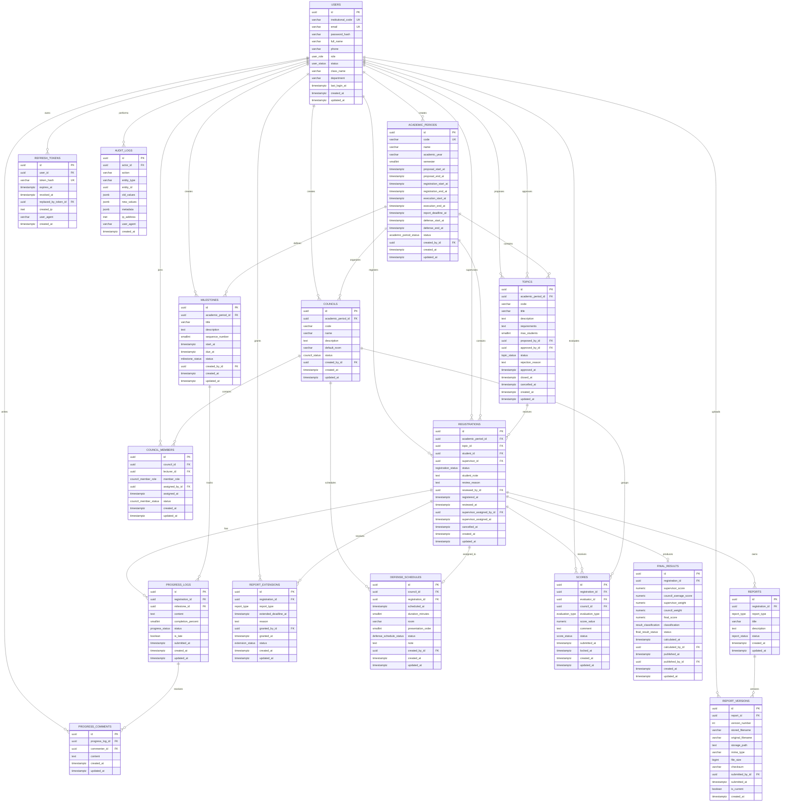

# Entity Relationship Design (ERD)

Version: 1.0

Status: Approved

Last Updated: 2026-08-04

---

# Purpose

This document defines the logical database design
for the Research Thesis Management System.

The objectives are:

- define all business entities
- define relationships
- define constraints
- define ownership
- support SQLAlchemy model generation
- support Alembic migration
- maintain database consistency

This document is the official reference
for database implementation.

---

# Database Overview

Database

PostgreSQL

ORM

SQLAlchemy 2.x

Migration

Alembic

Primary Key

UUID

Timestamp

UTC

Naming Convention

snake_case

---

# Design Principles

The database follows these principles.

## Single Source of Truth

Business information must exist only once.

Example

Correct

```
User

↓

Registration

↓

Topic
```

Incorrect

```
Registration

↓

Student Name
```

Student name already exists
inside User.

---

## Normalization

Target

Third Normal Form (3NF)

Avoid duplicated data.

Avoid redundant columns.

---

## Referential Integrity

Every relationship uses

Foreign Key.

No orphan records.

---

## Business Integrity

Database constraints
must enforce critical business rules.

Never rely only on frontend validation.

---

# Entity List

The project contains the following entities.

Core

- users
- academic_periods
- topics
- registrations

Progress

- milestones
- progress_logs
- progress_comments

Reports

- reports
- report_versions
- report_extensions

Council

- councils
- council_members
- defense_schedules

Evaluation

- scores
- final_results

Security

- refresh_tokens

Audit

- audit_logs

---

# Relationship Summary

```
User

↓

Topic

↓

Registration

↓

Progress

↓

Report

↓

Council

↓

Score

↓

Final Result
```

---

# Common Columns

Every business table contains

id

created_at

updated_at

Optional

created_by

updated_by

Primary Key

UUID

---

# Common Rules

Every table

must have

Primary Key.

Foreign Keys

must reference UUID.

Business status

must use Enum.

Important operations

must use transactions.

Historical information

must be preserved.

---

# Entity Ownership

| Entity | Owner |
|----------|--------|
| users | Member A |
| academic_periods | Member A |
| topics | Member A |
| registrations | Member A |
| milestones | Member B |
| progress_logs | Member B |
| progress_comments | Member B |
| reports | Member B |
| report_versions | Member B |
| report_extensions | Member B |
| councils | Member B |
| council_members | Member B |
| defense_schedules | Member B |
| scores | Member B |
| final_results | Member B |
| refresh_tokens | Shared |
| audit_logs | Shared |

---

# Relationship Rules

One User

↓

Many Topics

(lecturer)

One User

↓

Many Registrations

(student)

One Topic

↓

Many Registrations

One Registration

↓

Many Progress Logs

One Registration

↓

Many Report Versions

One Council

↓

Many Defense Schedules

One Defense Schedule

↓

One Registration

One Registration

↓

Many Scores

One Registration

↓

One Final Result

---

# Entity Documentation

The following sections describe every entity.

Each entity contains

Purpose

Columns

Primary Key

Foreign Keys

Unique Constraints

Indexes

Relationships

Business Rules
# Core Entity: users

## Purpose

Stores all system accounts.

The system supports three login roles:

- student
- lecturer
- admin

Council membership is not a separate login role.

A lecturer receives council permissions through council assignment.

---

## Table

```text
users
```

---

## Columns

| Column | Type | Nullable | Default | Description |
|---|---|---:|---|---|
| `id` | UUID | No | Generated UUID | Primary key |
| `institutional_code` | VARCHAR(50) | No | — | Student code, lecturer code, or institutional account code |
| `email` | VARCHAR(255) | No | — | Institutional email |
| `password_hash` | VARCHAR(255) | No | — | Secure password hash |
| `full_name` | VARCHAR(150) | No | — | User's full name |
| `phone` | VARCHAR(20) | Yes | NULL | Contact phone number |
| `role` | user_role | No | — | Login role |
| `status` | user_status | No | `active` | Account status |
| `class_name` | VARCHAR(100) | Yes | NULL | Student class |
| `department` | VARCHAR(150) | Yes | NULL | Lecturer/Admin department |
| `last_login_at` | TIMESTAMPTZ | Yes | NULL | Most recent successful login |
| `created_at` | TIMESTAMPTZ | No | Current UTC time | Creation time |
| `updated_at` | TIMESTAMPTZ | No | Current UTC time | Last update time |

---

## Primary Key

```text
PRIMARY KEY (id)
```

---

## Unique Constraints

```text
UNIQUE (institutional_code)
```

```text
UNIQUE (email)
```

Institutional codes and emails must not be shared between accounts.

---

## Indexes

Recommended indexes:

```text
INDEX users_role_idx (role)
```

```text
INDEX users_status_idx (status)
```

```text
INDEX users_full_name_idx (full_name)
```

The unique constraints already create indexes for:

- `institutional_code`
- `email`

---

## Enums

### user_role

```text
student
lecturer
admin
```

### user_status

```text
active
inactive
locked
```

---

## Relationships

One user may propose many topics.

```text
users.id
    1
    |
    N
topics.proposed_by_id
```

One Admin may review many topics.

```text
users.id
    1
    |
    N
topics.approved_by_id
```

One student may create many registration records over time.

```text
users.id
    1
    |
    N
registrations.student_id
```

One lecturer may supervise many approved registrations.

```text
users.id
    1
    |
    N
registrations.supervisor_id
```

One user may own many refresh tokens.

```text
users.id
    1
    |
    N
refresh_tokens.user_id
```

---

## Business Rules

- Accounts are created or imported by Admin.
- Public account registration is not supported.
- Login accepts either `email` or `institutional_code`.
- Passwords must never be stored as plaintext.
- Locked or inactive accounts cannot authenticate.
- Only Admin can change another user's role or status.
- Users may update only the profile fields allowed by the profile use case.
- A student normally has `class_name`.
- A lecturer normally has `department`.
- Role-specific profile fields may be NULL when they do not apply.
- A council member remains a user with role `lecturer`.
- Council permissions are determined from council membership, not from `users.role`.
- User records should not be physically deleted when academic records reference them.
- Important account changes must create audit-log records.

---

## Validation Rules

### institutional_code

- Required
- Trim surrounding whitespace
- Must be unique
- Maximum length: 50

### email

- Required
- Must be a valid email address
- Must be normalized before comparison
- Must be unique

### password_hash

- Required
- Must contain a secure password hash
- Must never be returned through an API

### full_name

- Required
- Must not contain only whitespace
- Maximum length: 150

### phone

- Optional
- Must follow the configured phone-number format

---

# Core Entity: academic_periods

## Purpose

Represents one managed academic execution period.

An academic period controls:

- topic proposal time
- topic registration time
- project execution time
- report submission deadline
- defense time
- active progress milestones

Admin manages academic periods through the administration interface.

Seed data is used only for development and demonstration.

---

## Table

```text
academic_periods
```

---

## Columns

| Column | Type | Nullable | Default | Description |
|---|---|---:|---|---|
| `id` | UUID | No | Generated UUID | Primary key |
| `code` | VARCHAR(50) | No | — | Unique period code |
| `name` | VARCHAR(150) | No | — | Display name |
| `academic_year` | VARCHAR(20) | No | — | Academic year, for example `2026-2027` |
| `semester` | SMALLINT | Yes | NULL | Semester number when applicable |
| `proposal_start_at` | TIMESTAMPTZ | No | — | Topic proposal opening time |
| `proposal_end_at` | TIMESTAMPTZ | No | — | Topic proposal closing time |
| `registration_start_at` | TIMESTAMPTZ | No | — | Student registration opening time |
| `registration_end_at` | TIMESTAMPTZ | No | — | Student registration closing time |
| `execution_start_at` | TIMESTAMPTZ | Yes | NULL | Project execution start |
| `execution_end_at` | TIMESTAMPTZ | Yes | NULL | Project execution end |
| `report_deadline_at` | TIMESTAMPTZ | Yes | NULL | Default final-report deadline |
| `defense_start_at` | TIMESTAMPTZ | Yes | NULL | Defense period opening time |
| `defense_end_at` | TIMESTAMPTZ | Yes | NULL | Defense period closing time |
| `status` | academic_period_status | No | `draft` | Current period status |
| `created_by_id` | UUID | No | — | Admin who created the period |
| `created_at` | TIMESTAMPTZ | No | Current UTC time | Creation time |
| `updated_at` | TIMESTAMPTZ | No | Current UTC time | Last update time |

---

## Primary Key

```text
PRIMARY KEY (id)
```

---

## Foreign Keys

```text
created_by_id
    REFERENCES users(id)
    ON DELETE RESTRICT
```

The creator must remain available for audit purposes.

---

## Unique Constraints

```text
UNIQUE (code)
```

Recommended period-code examples:

```text
KLTN-2026-1
NCKH-2026
```

---

## Check Constraints

```text
semester IS NULL
OR semester BETWEEN 1 AND 3
```

```text
proposal_start_at < proposal_end_at
```

```text
registration_start_at < registration_end_at
```

When both values exist:

```text
execution_start_at < execution_end_at
```

When both values exist:

```text
defense_start_at < defense_end_at
```

---

## Indexes

```text
INDEX academic_periods_status_idx (status)
```

```text
INDEX academic_periods_academic_year_idx (academic_year)
```

```text
INDEX academic_periods_registration_time_idx
(registration_start_at, registration_end_at)
```

---

## Enum

### academic_period_status

```text
draft
proposal_open
registration_open
in_progress
defense
completed
cancelled
```

---

## Relationships

One academic period contains many topics.

```text
academic_periods.id
    1
    |
    N
topics.academic_period_id
```

One academic period contains many registrations.

```text
academic_periods.id
    1
    |
    N
registrations.academic_period_id
```

One academic period defines many milestones.

```text
academic_periods.id
    1
    |
    N
milestones.academic_period_id
```

One academic period contains many councils.

```text
academic_periods.id
    1
    |
    N
councils.academic_period_id
```

---

## Business Rules

- Only Admin can create, update, open, close, or cancel an academic period.
- Topic proposal is allowed only inside the configured proposal interval.
- Student registration is allowed only inside the configured registration interval.
- A student may have at most one effective registration in one academic period.
- Progress milestones belong to one academic period.
- The default report deadline belongs to the academic period.
- Admin may grant a specific report extension to one registration.
- Defense schedules must fall inside the configured defense period when one is defined.
- Completed periods should become read-only except for explicitly authorized administrative corrections.
- Cancelling a period must not physically delete its topics, registrations, reports, scores, or results.
- Period status changes must create audit-log records.

---

## Status Transition

Recommended transitions:

```text
draft
  ↓
proposal_open
  ↓
registration_open
  ↓
in_progress
  ↓
defense
  ↓
completed
```

Cancellation may occur from an active state only through Admin authorization.

Invalid backward transitions should be rejected unless an explicit administrative correction is approved.

---

# Core Entity: topics

## Purpose

Stores topics proposed by lecturers for student registration.

A topic must be reviewed by Admin before publication.

---

## Table

```text
topics
```

---

## Columns

| Column | Type | Nullable | Default | Description |
|---|---|---:|---|---|
| `id` | UUID | No | Generated UUID | Primary key |
| `academic_period_id` | UUID | No | — | Academic period |
| `code` | VARCHAR(50) | No | — | Topic code within the period |
| `title` | VARCHAR(255) | No | — | Topic title |
| `description` | TEXT | No | — | Topic description |
| `requirements` | TEXT | Yes | NULL | Student prerequisites or input requirements |
| `max_students` | SMALLINT | No | `1` | Maximum approved students |
| `proposed_by_id` | UUID | No | — | Lecturer who proposed the topic |
| `approved_by_id` | UUID | Yes | NULL | Admin who reviewed the topic |
| `status` | topic_status | No | `pending_approval` | Current topic status |
| `rejection_reason` | TEXT | Yes | NULL | Required when rejected |
| `approved_at` | TIMESTAMPTZ | Yes | NULL | Approval time |
| `closed_at` | TIMESTAMPTZ | Yes | NULL | Closing time |
| `cancelled_at` | TIMESTAMPTZ | Yes | NULL | Cancellation time |
| `created_at` | TIMESTAMPTZ | No | Current UTC time | Creation time |
| `updated_at` | TIMESTAMPTZ | No | Current UTC time | Last update time |

---

## Primary Key

```text
PRIMARY KEY (id)
```

---

## Foreign Keys

```text
academic_period_id
    REFERENCES academic_periods(id)
    ON DELETE RESTRICT
```

```text
proposed_by_id
    REFERENCES users(id)
    ON DELETE RESTRICT
```

```text
approved_by_id
    REFERENCES users(id)
    ON DELETE RESTRICT
```

`approved_by_id` is NULL until an Admin reviews the topic.

---

## Unique Constraints

Topic code must be unique inside one period.

```text
UNIQUE (academic_period_id, code)
```

The same code may be reused in another academic period if the team accepts that convention.

---

## Check Constraints

```text
max_students >= 1
```

When status is rejected:

```text
status != 'rejected'
OR rejection_reason IS NOT NULL
```

When status is approved or closed:

```text
approved_by_id IS NOT NULL
```

---

## Indexes

```text
INDEX topics_period_idx (academic_period_id)
```

```text
INDEX topics_status_idx (status)
```

```text
INDEX topics_proposed_by_idx (proposed_by_id)
```

Recommended search index:

```text
title
```

A PostgreSQL full-text or trigram index may be added later if required.

---

## Enum

### topic_status

```text
pending_approval
approved
rejected
closed
cancelled
completed
```

`approved` means the topic is approved and available when the registration period is open.

`closed` means no additional registration is accepted.

Topic availability should also consider:

- academic-period status
- approved registration count
- `max_students`

---

## Relationships

One academic period contains many topics.

```text
academic_periods.id
    1
    |
    N
topics.academic_period_id
```

One lecturer may propose many topics.

```text
users.id
    1
    |
    N
topics.proposed_by_id
```

One topic may receive many registration requests.

```text
topics.id
    1
    |
    N
registrations.topic_id
```

---

## Business Rules

- Only lecturers may propose topics.
- Topic proposal is allowed only during the configured proposal interval.
- New topics start in `pending_approval`.
- Only Admin may approve or reject a topic.
- Rejection requires a reason.
- Approved topics are visible to students during the relevant registration period.
- The proposing lecturer is the default supervisor after registration approval.
- Admin may later assign another main supervisor.
- A topic cannot accept more approved registrations than `max_students`.
- When approved registrations reach `max_students`, the topic is closed automatically.
- Closing a topic prevents new registrations but preserves existing records.
- Cancelling a topic hides it from students.
- If a cancelled topic has pending registrations, those registrations are cancelled or rejected according to the approved service rule.
- A topic with officially approved students cannot be cancelled directly by a lecturer.
- Administrative intervention is required when cancelling a topic with approved students.
- Topics must not be physically deleted after they enter the review or registration workflow.
- Topic approval, rejection, closing, and cancellation must create audit-log records.

---

## Derived Availability

Do not store a duplicated `remaining_slots` column.

Calculate:

```text
remaining_slots =
max_students - approved_registration_count
```

Availability is true only when:

```text
topic.status = approved
AND academic period registration is open
AND approved_registration_count < max_students
```

---

# Core Entity: registrations

## Purpose

Stores student requests to perform topics.

A registration connects:

- one student
- one topic
- one academic period
- one main supervisor after approval or assignment

---

## Table

```text
registrations
```

---

## Columns

| Column | Type | Nullable | Default | Description |
|---|---|---:|---|---|
| `id` | UUID | No | Generated UUID | Primary key |
| `academic_period_id` | UUID | No | — | Academic period |
| `topic_id` | UUID | No | — | Requested topic |
| `student_id` | UUID | No | — | Student |
| `supervisor_id` | UUID | Yes | NULL | Official main supervisor |
| `status` | registration_status | No | `pending` | Current registration status |
| `student_note` | TEXT | Yes | NULL | Optional note from student |
| `review_reason` | TEXT | Yes | NULL | Rejection or administrative reason |
| `reviewed_by_id` | UUID | Yes | NULL | Lecturer/Admin who reviewed the request |
| `registered_at` | TIMESTAMPTZ | No | Current UTC time | Submission time |
| `reviewed_at` | TIMESTAMPTZ | Yes | NULL | Approval/rejection time |
| `supervisor_assigned_by_id` | UUID | Yes | NULL | Admin who assigned or changed supervisor |
| `supervisor_assigned_at` | TIMESTAMPTZ | Yes | NULL | Assignment time |
| `cancelled_at` | TIMESTAMPTZ | Yes | NULL | Cancellation time |
| `created_at` | TIMESTAMPTZ | No | Current UTC time | Creation time |
| `updated_at` | TIMESTAMPTZ | No | Current UTC time | Last update time |

---

## Primary Key

```text
PRIMARY KEY (id)
```

---

## Foreign Keys

```text
academic_period_id
    REFERENCES academic_periods(id)
    ON DELETE RESTRICT
```

```text
topic_id
    REFERENCES topics(id)
    ON DELETE RESTRICT
```

```text
student_id
    REFERENCES users(id)
    ON DELETE RESTRICT
```

```text
supervisor_id
    REFERENCES users(id)
    ON DELETE RESTRICT
```

```text
reviewed_by_id
    REFERENCES users(id)
    ON DELETE RESTRICT
```

```text
supervisor_assigned_by_id
    REFERENCES users(id)
    ON DELETE RESTRICT
```

---

## Enum

### registration_status

```text
pending
approved
rejected
cancelled
in_progress
completed
```

Effective registration statuses:

```text
pending
approved
in_progress
```

The duplicate-registration rule must consider all statuses defined as effective by the current business decision.

---

## Unique and Partial Constraints

A student may have only one effective registration in one academic period.

A normal unique constraint on:

```text
(student_id, academic_period_id)
```

is not sufficient because rejected or cancelled history should be preserved.

PostgreSQL should use a partial unique index similar to:

```sql
CREATE UNIQUE INDEX registrations_one_effective_per_student_period
ON registrations (student_id, academic_period_id)
WHERE status IN ('pending', 'approved', 'in_progress');
```

Exact enum handling in Alembic must match the implemented PostgreSQL enum strategy.

---

## Check Constraints

When status is approved or in progress:

```text
supervisor_id IS NOT NULL
```

When status is rejected:

```text
reviewed_at IS NOT NULL
```

When status is cancelled:

```text
cancelled_at IS NOT NULL
```

---

## Indexes

```text
INDEX registrations_period_idx (academic_period_id)
```

```text
INDEX registrations_topic_idx (topic_id)
```

```text
INDEX registrations_student_idx (student_id)
```

```text
INDEX registrations_supervisor_idx (supervisor_id)
```

```text
INDEX registrations_status_idx (status)
```

Recommended composite index:

```text
INDEX registrations_topic_status_idx (topic_id, status)
```

This supports topic-capacity queries.

---

## Relationships

One topic may have many registration requests.

```text
topics.id
    1
    |
    N
registrations.topic_id
```

One student may have many historical registrations.

```text
users.id
    1
    |
    N
registrations.student_id
```

Only one registration may be effective for the student in one academic period.

One lecturer may supervise many registrations.

```text
users.id
    1
    |
    N
registrations.supervisor_id
```

One registration has many progress logs.

```text
registrations.id
    1
    |
    N
progress_logs.registration_id
```

One registration has many report submissions or report versions.

```text
registrations.id
    1
    |
    N
reports.registration_id
```

One registration may have one defense schedule.

```text
registrations.id
    1
    |
    0..1
defense_schedules.registration_id
```

One registration has many scores.

```text
registrations.id
    1
    |
    N
scores.registration_id
```

One registration has at most one final result.

```text
registrations.id
    1
    |
    0..1
final_results.registration_id
```

---

## Business Rules

- Only users with role `student` may create registrations.
- Registration is allowed only during the active registration interval.
- The topic must be approved and accepting registrations.
- The system must recheck availability at the moment the request is submitted.
- A student cannot create a new registration while another effective registration exists in the same period.
- A pending registration may be cancelled by its student.
- An approved registration cannot be cancelled directly by the student.
- Changing an approved registration requires Admin intervention.
- Only the lecturer responsible for the topic or an explicitly authorized Admin may review the registration.
- Approval must occur inside a database transaction.
- Approval must lock or safely recheck topic capacity to prevent concurrent overbooking.
- The number of approved or in-progress registrations must never exceed `topics.max_students`.
- When capacity is reached, the topic is automatically closed.
- Remaining pending registrations for a full topic are rejected according to the approved workflow.
- The topic proposer becomes the default supervisor when the registration is approved.
- Admin may replace the main supervisor through the supervisor-assignment workflow.
- Phase 1 supports one main supervisor only.
- Registration approval, rejection, cancellation, and supervisor changes must create audit-log records.
- Registration records must not be physically deleted after submission.

---

## Approval Transaction

Registration approval should perform the following steps atomically:

```text
1. Load the pending registration.
2. Verify reviewer permission.
3. Verify the academic period is valid.
4. Verify the student has no other effective registration.
5. Lock or safely recheck topic capacity.
6. Verify the topic is still approved and available.
7. Assign the default supervisor when none is assigned.
8. Change registration status to approved.
9. Record reviewer and review time.
10. Recalculate approved registration count.
11. Close the topic if capacity is reached.
12. Reject remaining pending registrations if required.
13. Create audit-log records.
14. Commit the transaction.
```

If any step fails:

```text
ROLLBACK
```

No partial update is allowed.

---

# Core Entity Relationship Summary

```text
users
  ├── proposes ───────────────► topics
  ├── registers as student ───► registrations
  ├── supervises ─────────────► registrations
  └── creates ────────────────► academic_periods

academic_periods
  ├── contains ───────────────► topics
  └── contains ───────────────► registrations

topics
  └── receives ───────────────► registrations
```

---

# Part 2 Completion

The following core entities are now defined:

- users
- academic_periods
- topics
- registrations

These entities form the shared foundation for all later modules.

No later module may create duplicate versions of these entities.
# Progress Entity: milestones

## Purpose

Defines required progress checkpoints for one academic period.

Milestones may be configured by:

- Admin
- Supervisor, when the final implementation allows supervisor-specific configuration

Examples:

- Week 1 progress update
- Monthly progress update
- Proposal submission checkpoint
- Midterm progress checkpoint
- Final completion checkpoint

---

## Table

```text
milestones
```

---

## Columns

| Column | Type | Nullable | Default | Description |
|---|---|---:|---|---|
| `id` | UUID | No | Generated UUID | Primary key |
| `academic_period_id` | UUID | No | — | Academic period |
| `title` | VARCHAR(255) | No | — | Milestone title |
| `description` | TEXT | Yes | NULL | Instructions or expected work |
| `sequence_number` | SMALLINT | No | — | Display and execution order |
| `start_at` | TIMESTAMPTZ | Yes | NULL | Time from which updates are accepted |
| `due_at` | TIMESTAMPTZ | No | — | Progress-update deadline |
| `status` | milestone_status | No | `draft` | Milestone status |
| `created_by_id` | UUID | No | — | Admin or authorized lecturer |
| `created_at` | TIMESTAMPTZ | No | Current UTC time | Creation time |
| `updated_at` | TIMESTAMPTZ | No | Current UTC time | Last update time |

---

## Primary Key

```text
PRIMARY KEY (id)
```

---

## Foreign Keys

```text
academic_period_id
    REFERENCES academic_periods(id)
    ON DELETE RESTRICT
```

```text
created_by_id
    REFERENCES users(id)
    ON DELETE RESTRICT
```

---

## Unique Constraints

The sequence number must be unique within one academic period.

```text
UNIQUE (academic_period_id, sequence_number)
```

A title does not need to be globally unique.

---

## Check Constraints

```text
sequence_number >= 1
```

When `start_at` exists:

```text
start_at < due_at
```

---

## Indexes

```text
INDEX milestones_period_idx (academic_period_id)
```

```text
INDEX milestones_status_idx (status)
```

```text
INDEX milestones_due_at_idx (due_at)
```

---

## Enum

### milestone_status

```text
draft
active
closed
cancelled
```

---

## Relationships

One academic period has many milestones.

```text
academic_periods.id
    1
    |
    N
milestones.academic_period_id
```

One milestone receives many progress updates.

```text
milestones.id
    1
    |
    N
progress_logs.milestone_id
```

---

## Business Rules

- Milestones belong to exactly one academic period.
- A milestone must have a deadline.
- Students may update progress only for registrations in the same academic period.
- A draft milestone is not visible to students.
- An active milestone accepts progress updates.
- A closed milestone may still display historical updates.
- Late progress updates are accepted but marked late.
- Cancelling a milestone must not delete already submitted progress logs.
- Changing a milestone deadline after submissions exist should create an audit record.
- Phase 1 should prefer period-wide milestones to reduce complexity.
- Supervisor-specific milestones should not be implemented unless explicitly approved.

The use-case specification requires progress to be linked to configured weekly or monthly milestones and late updates to remain accepted but marked late. :contentReference[oaicite:0]{index=0}

---

# Progress Entity: progress_logs

## Purpose

Stores each progress update submitted by a student.

A progress update belongs to:

- one registration
- one milestone
- one student through the registration

Each submission is stored as a separate historical record.

---

## Table

```text
progress_logs
```

---

## Columns

| Column | Type | Nullable | Default | Description |
|---|---|---:|---|---|
| `id` | UUID | No | Generated UUID | Primary key |
| `registration_id` | UUID | No | — | Student registration |
| `milestone_id` | UUID | No | — | Related milestone |
| `content` | TEXT | No | — | Progress description |
| `completion_percent` | SMALLINT | Yes | NULL | Optional self-reported completion percentage |
| `status` | progress_status | No | `submitted` | Progress status |
| `is_late` | BOOLEAN | No | `false` | Whether submitted after deadline |
| `submitted_at` | TIMESTAMPTZ | No | Current UTC time | Submission time |
| `created_at` | TIMESTAMPTZ | No | Current UTC time | Creation time |
| `updated_at` | TIMESTAMPTZ | No | Current UTC time | Last update time |

---

## Primary Key

```text
PRIMARY KEY (id)
```

---

## Foreign Keys

```text
registration_id
    REFERENCES registrations(id)
    ON DELETE RESTRICT
```

```text
milestone_id
    REFERENCES milestones(id)
    ON DELETE RESTRICT
```

---

## Check Constraints

```text
content <> ''
```

When `completion_percent` is provided:

```text
completion_percent BETWEEN 0 AND 100
```

---

## Indexes

```text
INDEX progress_logs_registration_idx (registration_id)
```

```text
INDEX progress_logs_milestone_idx (milestone_id)
```

```text
INDEX progress_logs_submitted_at_idx (submitted_at)
```

```text
INDEX progress_logs_is_late_idx (is_late)
```

Recommended composite index:

```text
INDEX progress_logs_registration_milestone_idx
(registration_id, milestone_id)
```

---

## Enum

### progress_status

```text
submitted
reviewed
revision_required
accepted
```

Phase 1 may use only:

```text
submitted
reviewed
```

unless the revision workflow is explicitly implemented.

---

## Relationships

One registration has many progress logs.

```text
registrations.id
    1
    |
    N
progress_logs.registration_id
```

One milestone has many progress logs.

```text
milestones.id
    1
    |
    N
progress_logs.milestone_id
```

One progress log has many comments.

```text
progress_logs.id
    1
    |
    N
progress_comments.progress_log_id
```

---

## Business Rules

- Only the student who owns the registration may submit its progress.
- The registration must be approved or in progress.
- The registration must have an official supervisor.
- Content is required and cannot contain only whitespace.
- The milestone must belong to the same academic period as the registration.
- The system determines lateness by comparing `submitted_at` with `milestones.due_at`.
- Late submissions are stored and marked with `is_late = true`.
- Progress history must not be overwritten.
- A new submission creates a new record.
- Supervisors may view only progress belonging to registrations they supervise.
- Admin may view progress across the managed academic period.
- Progress submissions must not be physically deleted after review.
- A new progress submission may generate a dashboard alert or activity entry for the supervisor.
- Phase 1 does not require email notification.

UC13 requires the system to record each progress update against the corresponding milestone and to notify the supervisor of a new update; UC15 requires identifying missed deadlines. :contentReference[oaicite:1]{index=1} :contentReference[oaicite:2]{index=2}

---

## Late Progress Detection

A submitted progress log is late when:

```text
progress_logs.submitted_at > milestones.due_at
```

A missing-progress alert exists logically when:

```text
milestone.due_at < current_time
AND no progress_log exists
for the registration and milestone
```

Phase 1 may calculate this condition dynamically on the dashboard instead of storing a notification record.

---

# Progress Entity: progress_comments

## Purpose

Stores lecturer comments on specific progress submissions.

Comments are associated with one exact progress log, not only with the registration.

---

## Table

```text
progress_comments
```

---

## Columns

| Column | Type | Nullable | Default | Description |
|---|---|---:|---|---|
| `id` | UUID | No | Generated UUID | Primary key |
| `progress_log_id` | UUID | No | — | Related progress submission |
| `commenter_id` | UUID | No | — | Lecturer or authorized Admin |
| `content` | TEXT | No | — | Comment content |
| `created_at` | TIMESTAMPTZ | No | Current UTC time | Creation time |
| `updated_at` | TIMESTAMPTZ | No | Current UTC time | Last update time |

---

## Primary Key

```text
PRIMARY KEY (id)
```

---

## Foreign Keys

```text
progress_log_id
    REFERENCES progress_logs(id)
    ON DELETE RESTRICT
```

```text
commenter_id
    REFERENCES users(id)
    ON DELETE RESTRICT
```

---

## Check Constraints

```text
content <> ''
```

---

## Indexes

```text
INDEX progress_comments_log_idx (progress_log_id)
```

```text
INDEX progress_comments_commenter_idx (commenter_id)
```

```text
INDEX progress_comments_created_at_idx (created_at)
```

---

## Relationships

One progress log has many comments.

```text
progress_logs.id
    1
    |
    N
progress_comments.progress_log_id
```

One lecturer may write many progress comments.

```text
users.id
    1
    |
    N
progress_comments.commenter_id
```

---

## Business Rules

- Only the official supervisor may comment on progress in the normal workflow.
- Admin may comment only when explicitly authorized by the project policy.
- The commenter must have permission to view the registration.
- Comment content is required.
- Comments belong to one exact progress submission.
- Historical comments must remain available.
- Editing a comment is allowed only by its author and only before the configured lock condition, if implemented.
- Deleting reviewed comments should not be supported in Phase 1.
- Creating a comment may generate a dashboard activity indicator for the student.
- Email notification remains outside Phase 1.

UC14 explicitly requires a lecturer to select a particular progress update and attach a non-empty comment to that update. :contentReference[oaicite:3]{index=3}

---

# Report Entity: reports

## Purpose

Represents one logical report category belonging to a registration.

A report groups multiple uploaded versions of the same report type.

Examples:

- Proposal report
- Midterm report
- Final report
- Product package

This separation avoids repeating logical report information for every uploaded version.

---

## Table

```text
reports
```

---

## Columns

| Column | Type | Nullable | Default | Description |
|---|---|---:|---|---|
| `id` | UUID | No | Generated UUID | Primary key |
| `registration_id` | UUID | No | — | Related registration |
| `report_type` | report_type | No | — | Logical report category |
| `title` | VARCHAR(255) | No | — | Report title |
| `description` | TEXT | Yes | NULL | Optional description |
| `status` | report_status | No | `active` | Logical report status |
| `created_at` | TIMESTAMPTZ | No | Current UTC time | Creation time |
| `updated_at` | TIMESTAMPTZ | No | Current UTC time | Last update time |

---

## Primary Key

```text
PRIMARY KEY (id)
```

---

## Foreign Keys

```text
registration_id
    REFERENCES registrations(id)
    ON DELETE RESTRICT
```

---

## Unique Constraints

One registration should have only one logical report container per report type.

```text
UNIQUE (registration_id, report_type)
```

---

## Indexes

```text
INDEX reports_registration_idx (registration_id)
```

```text
INDEX reports_type_idx (report_type)
```

```text
INDEX reports_status_idx (status)
```

---

## Enums

### report_type

```text
proposal
midterm
final
product
other
```

The exact allowed types may be reduced or expanded before implementation.

### report_status

```text
active
closed
cancelled
```

---

## Relationships

One registration has many logical reports.

```text
registrations.id
    1
    |
    N
reports.registration_id
```

One report has many versions.

```text
reports.id
    1
    |
    N
report_versions.report_id
```

---

## Business Rules

- Only the student who owns the registration may submit a report version.
- The registration must be approved or in progress.
- Report types must use approved enum values.
- A registration may have one logical report record for each report type.
- Every upload creates a new version in `report_versions`.
- Logical reports must not be physically deleted once a version exists.
- Supervisors may view reports of registrations they supervise.
- Council members may view reports assigned to their council when required for evaluation.
- Admin may view reports within the managed scope.

---

# Report Entity: report_versions

## Purpose

Stores each uploaded report or product version.

Every upload creates a new immutable version.

Previous versions are preserved.

---

## Table

```text
report_versions
```

---

## Columns

| Column | Type | Nullable | Default | Description |
|---|---|---:|---|---|
| `id` | UUID | No | Generated UUID | Primary key |
| `report_id` | UUID | No | — | Logical report |
| `version_number` | INTEGER | No | — | Sequential version number |
| `stored_filename` | VARCHAR(255) | No | — | Generated safe storage filename |
| `original_filename` | VARCHAR(255) | No | — | Original user filename |
| `storage_path` | TEXT | No | — | Internal relative storage path |
| `mime_type` | VARCHAR(150) | No | — | Validated MIME type |
| `file_size` | BIGINT | No | — | File size in bytes |
| `checksum` | VARCHAR(128) | Yes | NULL | Optional integrity checksum |
| `submitted_by_id` | UUID | No | — | Student who uploaded the version |
| `submitted_at` | TIMESTAMPTZ | No | Current UTC time | Submission time |
| `is_current` | BOOLEAN | No | `true` | Whether this is the latest version |
| `created_at` | TIMESTAMPTZ | No | Current UTC time | Creation time |

---

## Primary Key

```text
PRIMARY KEY (id)
```

---

## Foreign Keys

```text
report_id
    REFERENCES reports(id)
    ON DELETE RESTRICT
```

```text
submitted_by_id
    REFERENCES users(id)
    ON DELETE RESTRICT
```

---

## Unique Constraints

```text
UNIQUE (report_id, version_number)
```

Only one current version should exist for each report.

Recommended PostgreSQL partial unique index:

```sql
CREATE UNIQUE INDEX report_versions_one_current
ON report_versions (report_id)
WHERE is_current = true;
```

---

## Check Constraints

```text
version_number >= 1
```

```text
file_size > 0
```

---

## Indexes

```text
INDEX report_versions_report_idx (report_id)
```

```text
INDEX report_versions_submitted_by_idx (submitted_by_id)
```

```text
INDEX report_versions_submitted_at_idx (submitted_at)
```

---

## Relationships

One report has many versions.

```text
reports.id
    1
    |
    N
report_versions.report_id
```

One student may upload many report versions.

```text
users.id
    1
    |
    N
report_versions.submitted_by_id
```

---

## Business Rules

- Every successful upload creates a new version.
- Existing files are never overwritten.
- `version_number` increases sequentially for each logical report.
- Version creation must be transactional.
- Before creating a new version, the previous current version is set to `is_current = false`.
- The new version is set to `is_current = true`.
- Stored filenames must be generated by the backend, preferably using UUID.
- Original filenames are stored for display and download.
- Physical server paths must never be returned to clients.
- File extension, MIME type, file size, ownership, and deadline must be validated before persistence.
- The recommended file-size limit is 20 MB, configurable through environment variables.
- A version submitted after the normal deadline is accepted only when a valid extension exists.
- Historical versions are read-only.
- Supervisors may view and download previous versions.
- Uploads should create audit or activity records when appropriate.

UC16–UC18 require file-format validation, deadline checking, a new stored version for every submission, and preservation of earlier versions. :contentReference[oaicite:4]{index=4} :contentReference[oaicite:5]{index=5}

---

## Version Creation Transaction

```text
1. Verify authenticated student.
2. Verify registration ownership.
3. Verify registration status.
4. Verify report deadline or valid extension.
5. Validate file size.
6. Validate file extension and MIME type.
7. Lock or safely read the logical report.
8. Determine next version number.
9. Mark previous current version as not current.
10. Store file using a generated filename.
11. Create report_versions record.
12. Mark new version as current.
13. Commit transaction.
```

If database persistence fails after physical file creation, the service must remove the orphan file.

---

# Report Entity: report_extensions

## Purpose

Stores Admin-granted deadline extensions for one registration and report type.

---

## Table

```text
report_extensions
```

---

## Columns

| Column | Type | Nullable | Default | Description |
|---|---|---:|---|---|
| `id` | UUID | No | Generated UUID | Primary key |
| `registration_id` | UUID | No | — | Extended registration |
| `report_type` | report_type | No | — | Report category |
| `extended_deadline_at` | TIMESTAMPTZ | No | — | New deadline |
| `reason` | TEXT | No | — | Administrative justification |
| `granted_by_id` | UUID | No | — | Admin who granted the extension |
| `granted_at` | TIMESTAMPTZ | No | Current UTC time | Grant time |
| `status` | extension_status | No | `active` | Extension status |
| `created_at` | TIMESTAMPTZ | No | Current UTC time | Creation time |
| `updated_at` | TIMESTAMPTZ | No | Current UTC time | Last update time |

---

## Primary Key

```text
PRIMARY KEY (id)
```

---

## Foreign Keys

```text
registration_id
    REFERENCES registrations(id)
    ON DELETE RESTRICT
```

```text
granted_by_id
    REFERENCES users(id)
    ON DELETE RESTRICT
```

---

## Enum

### extension_status

```text
active
expired
revoked
```

---

## Check Constraints

```text
reason <> ''
```

The extended deadline must be later than the normal applicable deadline.

---

## Indexes

```text
INDEX report_extensions_registration_idx (registration_id)
```

```text
INDEX report_extensions_deadline_idx (extended_deadline_at)
```

```text
INDEX report_extensions_status_idx (status)
```

---

## Business Rules

- Only Admin may grant or revoke an extension.
- An extension applies to one registration and one report type.
- A reason is mandatory.
- A new deadline is mandatory.
- The new deadline must be later than the normal deadline.
- Only one active extension should apply to the same registration and report type.
- Granting, updating, or revoking an extension must create an audit-log record.
- Expired and revoked extensions remain stored historically.
- A report may be submitted after the normal deadline only while an active extension remains valid.

UC18 explicitly requires Admin to provide a new deadline before confirming an extension. :contentReference[oaicite:6]{index=6}

---

# Progress and Report Relationship Summary

```text
academic_periods
    └── milestones
            └── progress_logs
                    └── progress_comments

registrations
    ├── progress_logs
    ├── reports
    │       └── report_versions
    └── report_extensions
```

---

# Part 3 Completion

The following entities are now defined:

- milestones
- progress_logs
- progress_comments
- reports
- report_versions
- report_extensions

These entities implement:

- FR-13 Progress Update
- FR-14 Progress Comment
- FR-15 Late Progress Alert
- FR-16 Report Submission
- FR-17 Report Version History
- FR-18 Deadline Validation and Extension
# Council Entity: councils

## Purpose

Stores defense and evaluation councils created by Admin.

One council may evaluate multiple registrations during one academic period.

A council contains multiple lecturer members.

---

## Table

```text
councils
```

---

## Columns

| Column | Type | Nullable | Default | Description |
|---|---|---:|---|---|
| `id` | UUID | No | Generated UUID | Primary key |
| `academic_period_id` | UUID | No | — | Academic period |
| `code` | VARCHAR(50) | No | — | Council code |
| `name` | VARCHAR(255) | No | — | Council display name |
| `description` | TEXT | Yes | NULL | Optional description |
| `default_room` | VARCHAR(100) | Yes | NULL | Default defense room |
| `status` | council_status | No | `draft` | Council status |
| `created_by_id` | UUID | No | — | Admin who created the council |
| `created_at` | TIMESTAMPTZ | No | Current UTC time | Creation time |
| `updated_at` | TIMESTAMPTZ | No | Current UTC time | Last update time |

---

## Primary Key

```text
PRIMARY KEY (id)
```

---

## Foreign Keys

```text
academic_period_id
    REFERENCES academic_periods(id)
    ON DELETE RESTRICT
```

```text
created_by_id
    REFERENCES users(id)
    ON DELETE RESTRICT
```

---

## Unique Constraints

Council code must be unique within one academic period.

```text
UNIQUE (academic_period_id, code)
```

---

## Indexes

```text
INDEX councils_period_idx (academic_period_id)
```

```text
INDEX councils_status_idx (status)
```

---

## Enum

### council_status

```text
draft
scheduled
in_progress
completed
cancelled
```

---

## Relationships

One academic period contains many councils.

```text
academic_periods.id
    1
    |
    N
councils.academic_period_id
```

One council has many members.

```text
councils.id
    1
    |
    N
council_members.council_id
```

One council has many defense schedules.

```text
councils.id
    1
    |
    N
defense_schedules.council_id
```

One council may be referenced by many council scores.

```text
councils.id
    1
    |
    N
scores.council_id
```

---

## Business Rules

- Only Admin may create, update, schedule, complete, or cancel a council.
- A council belongs to exactly one academic period.
- One council may evaluate multiple registrations.
- Council membership does not create a new login role.
- Only users with role `lecturer` may become council members.
- A council should have the required member roles before becoming scheduled.
- A cancelled council must not delete its historical schedules, members, scores, or audit logs.
- Council creation, membership changes, schedule changes, and cancellation must create audit-log records.
- Council members may view only registrations assigned to their council.
- Council status should become `completed` only after assigned defense activities and required scoring are complete.

The use case allows Admin to select one topic or a group of topics, choose lecturers, and arrange a separate defense schedule for each topic. :contentReference[oaicite:0]{index=0}

---

# Council Entity: council_members

## Purpose

Stores lecturers assigned to a defense council and their responsibility within that council.

Council membership provides temporary evaluation permission.

---

## Table

```text
council_members
```

---

## Columns

| Column | Type | Nullable | Default | Description |
|---|---|---:|---|---|
| `id` | UUID | No | Generated UUID | Primary key |
| `council_id` | UUID | No | — | Related council |
| `lecturer_id` | UUID | No | — | Lecturer member |
| `member_role` | council_member_role | No | `member` | Role within council |
| `assigned_by_id` | UUID | No | — | Admin who assigned the lecturer |
| `assigned_at` | TIMESTAMPTZ | No | Current UTC time | Assignment time |
| `status` | council_member_status | No | `active` | Membership status |
| `created_at` | TIMESTAMPTZ | No | Current UTC time | Creation time |
| `updated_at` | TIMESTAMPTZ | No | Current UTC time | Last update time |

---

## Primary Key

```text
PRIMARY KEY (id)
```

---

## Foreign Keys

```text
council_id
    REFERENCES councils(id)
    ON DELETE RESTRICT
```

```text
lecturer_id
    REFERENCES users(id)
    ON DELETE RESTRICT
```

```text
assigned_by_id
    REFERENCES users(id)
    ON DELETE RESTRICT
```

---

## Unique Constraints

A lecturer may appear only once in one council.

```text
UNIQUE (council_id, lecturer_id)
```

Recommended partial unique constraints:

```text
One active chairperson per council
```

```text
One active secretary per council
```

These may be implemented with PostgreSQL partial unique indexes.

---

## Indexes

```text
INDEX council_members_council_idx (council_id)
```

```text
INDEX council_members_lecturer_idx (lecturer_id)
```

```text
INDEX council_members_role_idx (member_role)
```

---

## Enums

### council_member_role

```text
chairperson
secretary
reviewer
member
```

### council_member_status

```text
active
inactive
removed
```

---

## Relationships

One council has many members.

```text
councils.id
    1
    |
    N
council_members.council_id
```

One lecturer may participate in many councils over time.

```text
users.id
    1
    |
    N
council_members.lecturer_id
```

---

## Business Rules

- Only users with role `lecturer` may be assigned as council members.
- Council membership is not stored in `users.role`.
- Membership grants scoring permission only for registrations scheduled under that council.
- A lecturer cannot be assigned twice to the same council.
- A council should have exactly one active chairperson.
- A council should have exactly one active secretary when the project requires that role.
- Removing a member must not delete their historical scores.
- A member who has already submitted a score should normally be deactivated rather than physically removed.
- Admin assigns and changes council membership.
- Membership changes must create audit-log records.
- Scoring permission is revoked when membership becomes inactive or the evaluation period ends.

SRS states that a lecturer uses the same lecturer account for council work and gains extra scoring functionality only after council assignment. :contentReference[oaicite:1]{index=1}

---

# Council Entity: defense_schedules

## Purpose

Assigns one registration to one council with its own defense time, room, and order.

This entity separates council identity from each registration's individual schedule.

---

## Table

```text
defense_schedules
```

---

## Columns

| Column | Type | Nullable | Default | Description |
|---|---|---:|---|---|
| `id` | UUID | No | Generated UUID | Primary key |
| `council_id` | UUID | No | — | Assigned council |
| `registration_id` | UUID | No | — | Registration being defended |
| `scheduled_at` | TIMESTAMPTZ | No | — | Defense start time |
| `duration_minutes` | SMALLINT | No | `45` | Planned duration |
| `room` | VARCHAR(100) | No | — | Defense room |
| `presentation_order` | SMALLINT | Yes | NULL | Order within the council |
| `status` | defense_schedule_status | No | `scheduled` | Defense status |
| `note` | TEXT | Yes | NULL | Optional administrative note |
| `created_by_id` | UUID | No | — | Admin who created the schedule |
| `created_at` | TIMESTAMPTZ | No | Current UTC time | Creation time |
| `updated_at` | TIMESTAMPTZ | No | Current UTC time | Last update time |

---

## Primary Key

```text
PRIMARY KEY (id)
```

---

## Foreign Keys

```text
council_id
    REFERENCES councils(id)
    ON DELETE RESTRICT
```

```text
registration_id
    REFERENCES registrations(id)
    ON DELETE RESTRICT
```

```text
created_by_id
    REFERENCES users(id)
    ON DELETE RESTRICT
```

---

## Unique Constraints

A registration may have only one active defense schedule in one academic period.

Recommended constraint:

```text
UNIQUE (registration_id)
```

This is suitable while Phase 1 supports one official defense event per registration.

Within a council:

```text
UNIQUE (council_id, presentation_order)
```

when `presentation_order` is not NULL.

---

## Check Constraints

```text
duration_minutes > 0
```

When presentation order exists:

```text
presentation_order >= 1
```

---

## Indexes

```text
INDEX defense_schedules_council_idx (council_id)
```

```text
INDEX defense_schedules_registration_idx (registration_id)
```

```text
INDEX defense_schedules_time_idx (scheduled_at)
```

```text
INDEX defense_schedules_status_idx (status)
```

---

## Enum

### defense_schedule_status

```text
scheduled
presented
completed
absent
postponed
cancelled
```

---

## Relationships

One council has many defense schedules.

```text
councils.id
    1
    |
    N
defense_schedules.council_id
```

One registration has at most one official defense schedule in Phase 1.

```text
registrations.id
    1
    |
    0..1
defense_schedules.registration_id
```

---

## Business Rules

- Only Admin may create, modify, postpone, or cancel a defense schedule.
- The registration must be approved, in progress, or otherwise eligible for defense.
- The council and registration must belong to the same academic period.
- Each registration has its own defense time and room.
- One council may have many defense schedules.
- A registration may belong to only one council in the same official evaluation cycle.
- The schedule should fall inside the academic period's defense interval when configured.
- `presentation_order` should be unique within one council.
- The system should detect lecturer schedule conflicts across councils.
- The system should detect room and time conflicts when the scope allows.
- Schedule changes must preserve audit history.
- Cancelling a schedule must not delete council assignments or previously submitted scores.
- Council members may score only registrations assigned through a valid defense schedule.

---

## Schedule Conflict Rule

Two defense schedules conflict when their time intervals overlap and at least one of the following is true:

```text
same room
```

or:

```text
same lecturer appears in both councils
```

Phase 1 may implement warnings instead of hard blocking, but the selected behavior must be recorded in `DECISIONS.md`.

---

# Evaluation Entity: scores

## Purpose

Stores individual evaluation scores and comments.

The same table supports:

- Supervisor process evaluation
- Council defense evaluation

---

## Table

```text
scores
```

---

## Columns

| Column | Type | Nullable | Default | Description |
|---|---|---:|---|---|
| `id` | UUID | No | Generated UUID | Primary key |
| `registration_id` | UUID | No | — | Evaluated registration |
| `evaluator_id` | UUID | No | — | Lecturer who submitted the score |
| `council_id` | UUID | Yes | NULL | Council for council-based evaluation |
| `evaluation_type` | evaluation_type | No | — | Supervisor or council evaluation |
| `score_value` | NUMERIC(5,2) | No | — | Score value |
| `comment` | TEXT | Yes | NULL | Evaluation comment |
| `status` | score_status | No | `draft` | Score lifecycle |
| `submitted_at` | TIMESTAMPTZ | Yes | NULL | Submission time |
| `locked_at` | TIMESTAMPTZ | Yes | NULL | Time score became read-only |
| `created_at` | TIMESTAMPTZ | No | Current UTC time | Creation time |
| `updated_at` | TIMESTAMPTZ | No | Current UTC time | Last update time |

---

## Primary Key

```text
PRIMARY KEY (id)
```

---

## Foreign Keys

```text
registration_id
    REFERENCES registrations(id)
    ON DELETE RESTRICT
```

```text
evaluator_id
    REFERENCES users(id)
    ON DELETE RESTRICT
```

```text
council_id
    REFERENCES councils(id)
    ON DELETE RESTRICT
```

---

## Unique Constraints

One evaluator may submit one score for one registration and one evaluation type.

```text
UNIQUE (
    registration_id,
    evaluator_id,
    evaluation_type
)
```

---

## Check Constraints

Recommended score range:

```text
score_value BETWEEN 0 AND 10
```

The final scale must match the confirmed project decision.

Council evaluation requires a council reference:

```text
evaluation_type != 'council'
OR council_id IS NOT NULL
```

Supervisor evaluation does not require a council reference:

```text
evaluation_type != 'supervisor'
OR council_id IS NULL
```

---

## Indexes

```text
INDEX scores_registration_idx (registration_id)
```

```text
INDEX scores_evaluator_idx (evaluator_id)
```

```text
INDEX scores_council_idx (council_id)
```

```text
INDEX scores_type_idx (evaluation_type)
```

```text
INDEX scores_status_idx (status)
```

---

## Enums

### evaluation_type

```text
supervisor
council
```

### score_status

```text
draft
submitted
locked
```

---

## Relationships

One registration has many scores.

```text
registrations.id
    1
    |
    N
scores.registration_id
```

One lecturer may submit many scores.

```text
users.id
    1
    |
    N
scores.evaluator_id
```

One council may contain many council scores.

```text
councils.id
    1
    |
    N
scores.council_id
```

---

## Business Rules

### Supervisor score

- Only the registration's current official supervisor may submit the supervisor score.
- One supervisor score exists per registration.
- The supervisor score represents process evaluation.
- The score may be edited while its status is `draft` or before final-result publication.
- A supervisor score uses `evaluation_type = supervisor`.
- `council_id` must be NULL.

### Council score

- Only an active member of the assigned council may submit a council score.
- The registration must be assigned to that council through `defense_schedules`.
- One council score exists per evaluator per registration.
- A lecturer may not score a registration outside their assigned council.
- A council score uses `evaluation_type = council`.
- `council_id` is required.

### Common rules

- Score range must be validated in Pydantic, service logic, and database constraints.
- Submitted scores may be edited only before result publication.
- Scores become locked after final-result publication.
- Score creation and modification must create audit-log records.
- Scores must not be physically deleted after submission.
- The system should prevent final calculation while required scores are missing.

The SRS requires council-assigned lecturers to enter scores and comments, while final calculation uses both supervisor and council scores. :contentReference[oaicite:2]{index=2}

---

# Evaluation Entity: final_results

## Purpose

Stores the calculated and published final evaluation result for one registration.

A final result summarizes supervisor and council evaluations.

---

## Table

```text
final_results
```

---

## Columns

| Column | Type | Nullable | Default | Description |
|---|---|---:|---|---|
| `id` | UUID | No | Generated UUID | Primary key |
| `registration_id` | UUID | No | — | Evaluated registration |
| `supervisor_score` | NUMERIC(5,2) | No | — | Snapshot of supervisor score |
| `council_average_score` | NUMERIC(5,2) | No | — | Snapshot of council average |
| `supervisor_weight` | NUMERIC(5,2) | No | `40.00` | Supervisor weight percent |
| `council_weight` | NUMERIC(5,2) | No | `60.00` | Council weight percent |
| `final_score` | NUMERIC(5,2) | No | — | Calculated total |
| `classification` | result_classification | Yes | NULL | Optional classification |
| `status` | final_result_status | No | `draft` | Result lifecycle |
| `calculated_at` | TIMESTAMPTZ | No | Current UTC time | Calculation time |
| `calculated_by_id` | UUID | Yes | NULL | User or system actor responsible |
| `published_at` | TIMESTAMPTZ | Yes | NULL | Publication time |
| `published_by_id` | UUID | Yes | NULL | Admin who published |
| `created_at` | TIMESTAMPTZ | No | Current UTC time | Creation time |
| `updated_at` | TIMESTAMPTZ | No | Current UTC time | Last update time |

---

## Primary Key

```text
PRIMARY KEY (id)
```

---

## Foreign Keys

```text
registration_id
    REFERENCES registrations(id)
    ON DELETE RESTRICT
```

```text
calculated_by_id
    REFERENCES users(id)
    ON DELETE RESTRICT
```

```text
published_by_id
    REFERENCES users(id)
    ON DELETE RESTRICT
```

---

## Unique Constraints

One registration has at most one final result.

```text
UNIQUE (registration_id)
```

---

## Check Constraints

```text
supervisor_score BETWEEN 0 AND 10
```

```text
council_average_score BETWEEN 0 AND 10
```

```text
final_score BETWEEN 0 AND 10
```

```text
supervisor_weight >= 0
AND council_weight >= 0
```

```text
supervisor_weight + council_weight = 100
```

When status is published:

```text
published_at IS NOT NULL
AND published_by_id IS NOT NULL
```

---

## Indexes

```text
INDEX final_results_status_idx (status)
```

```text
INDEX final_results_final_score_idx (final_score)
```

```text
INDEX final_results_published_at_idx (published_at)
```

---

## Enums

### final_result_status

```text
draft
calculated
published
cancelled
```

### result_classification

Provisional values:

```text
excellent
good
fair
average
failed
```

The classification thresholds must be confirmed before implementation.

---

## Relationships

One registration has at most one final result.

```text
registrations.id
    1
    |
    0..1
final_results.registration_id
```

---

## Business Rules

- Final calculation requires one submitted supervisor score.
- Final calculation requires all required active council members to submit council scores.
- The council average is calculated from valid submitted council scores.
- Default formula:

```text
final_score =
supervisor_score × 0.40
+
council_average_score × 0.60
```

- The calculation formula may become configurable later.
- Phase 1 uses the approved default formula unless the final requirements specify another formula.
- Calculation should store snapshot values and weights.
- Recalculation is allowed only before publication.
- Only Admin may publish the final result.
- Publishing locks related scores.
- Published results are read-only in the normal workflow.
- Reopening a published result requires explicit Admin authorization and an audit record.
- Students may view results only after publication.
- Result calculation and publication must create audit-log records.
- Final results must not be physically deleted.

---

## Result Calculation Transaction

```text
1. Load registration.
2. Verify registration is eligible for result calculation.
3. Load submitted supervisor score.
4. Load assigned council and active council members.
5. Load submitted council scores.
6. Verify all required scores exist.
7. Calculate council average.
8. Apply approved weights.
9. Create or update draft final result.
10. Store score and weight snapshots.
11. Mark result as calculated.
12. Create audit-log entry.
13. Commit transaction.
```

---

## Result Publication Transaction

```text
1. Load calculated final result.
2. Verify Admin permission.
3. Verify result is complete.
4. Set result status to published.
5. Set published_at and published_by_id.
6. Lock all related scores.
7. Update registration status when required.
8. Create audit-log entry.
9. Commit transaction.
```

If any step fails:

```text
ROLLBACK
```

---

# Council and Evaluation Relationship Summary

```text
academic_periods
    └── councils
            ├── council_members
            └── defense_schedules
                    └── registrations

registrations
    ├── scores
    │     ├── supervisor evaluation
    │     └── council evaluation
    └── final_results
```

---

# Part 4 Completion

The following entities are now defined:

- councils
- council_members
- defense_schedules
- scores
- final_results

These entities implement:

- FR-19 Council Creation and Defense Scheduling
- FR-20 Supervisor and Council Scoring
- FR-21 Final Result Calculation and Publication
# Security Entity: refresh_tokens

## Purpose

Stores hashed refresh-token records used to maintain authenticated sessions.

Access tokens are not stored in the database.

Each refresh token belongs to one user and may be revoked independently.

---

## Table

```text
refresh_tokens
```

---

## Columns

| Column | Type | Nullable | Default | Description |
|---|---|---:|---|---|
| `id` | UUID | No | Generated UUID | Primary key |
| `user_id` | UUID | No | — | Token owner |
| `token_hash` | VARCHAR(255) | No | — | Secure hash of refresh token |
| `expires_at` | TIMESTAMPTZ | No | — | Expiration time |
| `revoked_at` | TIMESTAMPTZ | Yes | NULL | Revocation time |
| `replaced_by_token_id` | UUID | Yes | NULL | Token created by rotation |
| `created_ip` | INET | Yes | NULL | Optional creation IP |
| `user_agent` | VARCHAR(500) | Yes | NULL | Optional client user-agent |
| `created_at` | TIMESTAMPTZ | No | Current UTC time | Creation time |

---

## Primary Key

```text
PRIMARY KEY (id)
```

---

## Foreign Keys

```text
user_id
    REFERENCES users(id)
    ON DELETE RESTRICT
```

```text
replaced_by_token_id
    REFERENCES refresh_tokens(id)
    ON DELETE SET NULL
```

---

## Unique Constraints

```text
UNIQUE (token_hash)
```

---

## Indexes

```text
INDEX refresh_tokens_user_idx (user_id)
```

```text
INDEX refresh_tokens_expires_at_idx (expires_at)
```

```text
INDEX refresh_tokens_revoked_at_idx (revoked_at)
```

Recommended cleanup index:

```text
INDEX refresh_tokens_active_idx
(user_id, expires_at)
WHERE revoked_at IS NULL
```

---

## Relationships

One user may have many refresh-token records.

```text
users.id
    1
    |
    N
refresh_tokens.user_id
```

One refresh token may be replaced by another during rotation.

```text
refresh_tokens.id
    1
    |
    0..1
refresh_tokens.replaced_by_token_id
```

---

## Business Rules

- Refresh tokens are returned to authenticated clients but stored only as hashes.
- Access tokens are never stored in the database.
- A refresh token is valid only when:
  - its hash matches
  - it has not expired
  - `revoked_at` is NULL
  - its user account remains active
- Refresh-token rotation is used.
- After successful rotation:
  - the old token is revoked
  - the new token is stored
  - `replaced_by_token_id` references the new token
- Logout revokes the submitted refresh token.
- Role changes, account locking, or security incidents may revoke all active refresh tokens for a user.
- Expired and revoked records may be removed by a scheduled cleanup task after the configured retention period.
- Raw refresh tokens must never appear in logs.
- Token hashes must never be returned through APIs.
- Authentication failures should not reveal whether a token record exists.

UC01 requires a valid authenticated session and logout behavior, while SRS requires password hashing and backend-enforced authorization. :contentReference[oaicite:0]{index=0} :contentReference[oaicite:1]{index=1}

---

# Audit Entity: audit_logs

## Purpose

Stores immutable records of important system actions.

Audit logs support:

- traceability
- accountability
- debugging
- administrative review

Audit logs are different from normal application logs.

---

## Table

```text
audit_logs
```

---

## Columns

| Column | Type | Nullable | Default | Description |
|---|---|---:|---|---|
| `id` | UUID | No | Generated UUID | Primary key |
| `actor_id` | UUID | Yes | NULL | User who performed the action |
| `action` | VARCHAR(100) | No | — | Stable action code |
| `entity_type` | VARCHAR(100) | No | — | Affected entity category |
| `entity_id` | UUID | Yes | NULL | Affected entity identifier |
| `old_values` | JSONB | Yes | NULL | Safe snapshot before change |
| `new_values` | JSONB | Yes | NULL | Safe snapshot after change |
| `metadata` | JSONB | Yes | NULL | Additional safe contextual data |
| `ip_address` | INET | Yes | NULL | Optional actor IP |
| `user_agent` | VARCHAR(500) | Yes | NULL | Optional user-agent |
| `created_at` | TIMESTAMPTZ | No | Current UTC time | Event time |

---

## Primary Key

```text
PRIMARY KEY (id)
```

---

## Foreign Keys

```text
actor_id
    REFERENCES users(id)
    ON DELETE SET NULL
```

`actor_id` may be NULL for:

- system-generated events
- historical records after account anonymization
- automated jobs

---

## Indexes

```text
INDEX audit_logs_actor_idx (actor_id)
```

```text
INDEX audit_logs_action_idx (action)
```

```text
INDEX audit_logs_entity_idx (entity_type, entity_id)
```

```text
INDEX audit_logs_created_at_idx (created_at)
```

Recommended composite index:

```text
INDEX audit_logs_entity_time_idx
(entity_type, entity_id, created_at)
```

---

## Relationships

One user may create many audit records.

```text
users.id
    1
    |
    N
audit_logs.actor_id
```

`entity_id` is a generic reference and does not use a direct foreign key because audit logs may reference multiple entity types.

---

## Business Rules

- Audit logs are append-only.
- Normal application users cannot update or delete audit records.
- Only authorized Admin users may view audit logs.
- Audit records must never contain:
  - plaintext passwords
  - password hashes
  - access tokens
  - refresh tokens
  - refresh-token hashes
  - private keys
  - secret environment values
  - raw uploaded-file contents
- `old_values` and `new_values` should contain only fields necessary for traceability.
- The action code must be stable and use uppercase `snake_case`.
- Audit logging should not expose internal exceptions to API clients.
- Business operations should create audit records in the same database transaction when practical.
- Failed transactions must not leave misleading successful audit records.
- Historical audit records must remain available after business entities are closed or cancelled.

SRS explicitly requires audit logs for topic approval, supervisor assignment, and score entry. :contentReference[oaicite:2]{index=2}

---

## Recommended Audit Actions

```text
AUTH_LOGIN_SUCCESS
AUTH_LOGOUT
USER_CREATED
USER_IMPORTED
USER_LOCKED
USER_UNLOCKED
USER_ROLE_CHANGED

ACADEMIC_PERIOD_CREATED
ACADEMIC_PERIOD_STATUS_CHANGED

TOPIC_PROPOSED
TOPIC_APPROVED
TOPIC_REJECTED
TOPIC_CLOSED
TOPIC_CANCELLED

REGISTRATION_CREATED
REGISTRATION_APPROVED
REGISTRATION_REJECTED
REGISTRATION_CANCELLED
SUPERVISOR_ASSIGNED
SUPERVISOR_CHANGED

MILESTONE_CREATED
MILESTONE_DEADLINE_CHANGED

REPORT_VERSION_SUBMITTED
REPORT_EXTENSION_GRANTED
REPORT_EXTENSION_REVOKED

COUNCIL_CREATED
COUNCIL_MEMBER_ADDED
COUNCIL_MEMBER_REMOVED
DEFENSE_SCHEDULE_CREATED
DEFENSE_SCHEDULE_CHANGED

SCORE_SUBMITTED
SCORE_UPDATED
FINAL_RESULT_CALCULATED
FINAL_RESULT_PUBLISHED
```

---

# Full Entity Catalog

The approved logical entities are:

## Core

```text
users
academic_periods
topics
registrations
```

## Progress

```text
milestones
progress_logs
progress_comments
```

## Reports

```text
reports
report_versions
report_extensions
```

## Councils

```text
councils
council_members
defense_schedules
```

## Evaluation

```text
scores
final_results
```

## Security

```text
refresh_tokens
```

## Audit

```text
audit_logs
```

---

# Complete Relationship Summary

```text
users
  ├── creates ─────────────────────────► academic_periods
  ├── proposes ────────────────────────► topics
  ├── reviews ─────────────────────────► topics
  ├── registers as student ────────────► registrations
  ├── supervises ──────────────────────► registrations
  ├── reviews registrations ───────────► registrations
  ├── creates milestones ──────────────► milestones
  ├── comments on progress ────────────► progress_comments
  ├── uploads report versions ─────────► report_versions
  ├── grants extensions ───────────────► report_extensions
  ├── creates councils ────────────────► councils
  ├── joins councils ──────────────────► council_members
  ├── creates defense schedules ───────► defense_schedules
  ├── submits scores ──────────────────► scores
  ├── publishes results ───────────────► final_results
  ├── owns refresh tokens ─────────────► refresh_tokens
  └── performs audited actions ────────► audit_logs

academic_periods
  ├── contains ────────────────────────► topics
  ├── contains ────────────────────────► registrations
  ├── defines ─────────────────────────► milestones
  └── organizes ───────────────────────► councils

topics
  └── receives ────────────────────────► registrations

registrations
  ├── has ─────────────────────────────► progress_logs
  ├── has ─────────────────────────────► reports
  ├── receives extensions ─────────────► report_extensions
  ├── receives defense schedule ───────► defense_schedules
  ├── receives scores ─────────────────► scores
  └── produces ────────────────────────► final_results

milestones
  └── receives ────────────────────────► progress_logs

progress_logs
  └── receives ────────────────────────► progress_comments

reports
  └── contains ────────────────────────► report_versions

councils
  ├── contains ────────────────────────► council_members
  ├── schedules ───────────────────────► defense_schedules
  └── groups ──────────────────────────► scores
```

---

# Mermaid ER Diagram



---

# Approved Enum Catalog

## user_role

```text
student
lecturer
admin
```

## user_status

```text
active
inactive
locked
```

## academic_period_status

```text
draft
proposal_open
registration_open
in_progress
defense
completed
cancelled
```

## topic_status

```text
pending_approval
approved
rejected
closed
cancelled
completed
```

## registration_status

```text
pending
approved
rejected
cancelled
in_progress
completed
```

## milestone_status

```text
draft
active
closed
cancelled
```

## progress_status

```text
submitted
reviewed
revision_required
accepted
```

## report_type

```text
proposal
midterm
final
product
other
```

## report_status

```text
active
closed
cancelled
```

## extension_status

```text
active
expired
revoked
```

## council_status

```text
draft
scheduled
in_progress
completed
cancelled
```

## council_member_role

```text
chairperson
secretary
reviewer
member
```

## council_member_status

```text
active
inactive
removed
```

## defense_schedule_status

```text
scheduled
presented
completed
absent
postponed
cancelled
```

## evaluation_type

```text
supervisor
council
```

## score_status

```text
draft
submitted
locked
```

## final_result_status

```text
draft
calculated
published
cancelled
```

## result_classification

Provisional:

```text
excellent
good
fair
average
failed
```

---

# Critical PostgreSQL Constraints

The following constraints require special attention during Alembic migration.

## One Effective Registration per Student and Period

```sql
CREATE UNIQUE INDEX registrations_one_effective_per_student_period
ON registrations (student_id, academic_period_id)
WHERE status IN ('pending', 'approved', 'in_progress');
```

---

## One Current Report Version

```sql
CREATE UNIQUE INDEX report_versions_one_current
ON report_versions (report_id)
WHERE is_current = true;
```

---

## One Active Extension per Registration and Report Type

Recommended:

```sql
CREATE UNIQUE INDEX report_extensions_one_active
ON report_extensions (registration_id, report_type)
WHERE status = 'active';
```

---

## One Chairperson per Council

Recommended:

```sql
CREATE UNIQUE INDEX council_members_one_chairperson
ON council_members (council_id)
WHERE member_role = 'chairperson'
AND status = 'active';
```

---

## One Secretary per Council

Recommended:

```sql
CREATE UNIQUE INDEX council_members_one_secretary
ON council_members (council_id)
WHERE member_role = 'secretary'
AND status = 'active';
```

---

## One Defense Schedule per Registration

```text
UNIQUE (registration_id)
```

---

## One Final Result per Registration

```text
UNIQUE (registration_id)
```

---

## Score Range

```text
CHECK (score_value BETWEEN 0 AND 10)
```

---

## Final Weight Sum

```text
CHECK (supervisor_weight + council_weight = 100)
```

---

# Transaction-Critical Operations

The following service operations must use database transactions:

```text
registration approval
topic automatic closing
supervisor assignment or replacement
report-version creation
report-extension granting
council scheduling
score submission when state changes occur
final-result calculation
final-result publication
refresh-token rotation
```

---

# Derived Values

The following values must normally be calculated, not duplicated.

## Remaining Topic Slots

```text
max_students - approved_registration_count
```

## Topic Availability

```text
topic approved
AND registration period open
AND approved count < max_students
```

## Late Progress

```text
progress_logs.submitted_at > milestones.due_at
```

## Missing Progress Alert

```text
milestone overdue
AND no matching progress log
```

## Current Report Version

Resolved through:

```text
report_versions.is_current = true
```

## Council Average

```text
average of submitted council scores
```

## Final Score

```text
supervisor_score × 0.40
+
council_average_score × 0.60
```

---

# Items Requiring Final Confirmation Before Models

The source documents do not fully define the following values.

They must be confirmed before final implementation.

## Report File Types

Provisional:

```text
pdf
doc
docx
zip
```

## Score Scale

Provisional:

```text
0 to 10
```

## Result Classification Thresholds

Not specified in the current SRS or use cases.

Do not implement permanent thresholds until confirmed.

## Minimum Council Composition

The documents require multiple lecturers but do not define an exact minimum number or mandatory role set.

## Supervisor-Specific Milestones

The SRS permits milestones configured by GVHD or Admin, but the current design uses period-wide milestones in Phase 1 for simplicity.

## Schedule Conflict Behavior

The database design supports conflict detection, but whether conflicts are blocked or shown as warnings must be confirmed.

## Account Import Format

Charter includes bulk account creation/import, but the exact Excel/CSV columns are not defined.

---

# Recommended Initial Migration Order

```text
1. PostgreSQL enum types
2. users
3. academic_periods
4. topics
5. registrations
6. milestones
7. progress_logs
8. progress_comments
9. reports
10. report_versions
11. report_extensions
12. councils
13. council_members
14. defense_schedules
15. scores
16. final_results
17. refresh_tokens
18. audit_logs
19. partial unique indexes
20. additional check constraints
```

---

# ERD Implementation Rule

Before creating SQLAlchemy models:

1. Review this document.
2. Resolve all pending decisions.
3. Confirm enum values.
4. Confirm table names.
5. Confirm foreign-key behavior.
6. Confirm unique and partial indexes.
7. Assign one migration owner.
8. Generate and manually review Alembic migration.
9. Test upgrade from an empty database.
10. Test downgrade before merging.

---

# Final ERD Status

Logical design:

```text
Approved for project setup
```

Physical schema:

```text
Pending model and migration implementation
```

Open items must be resolved before affected features are implemented.

---

# End of Document