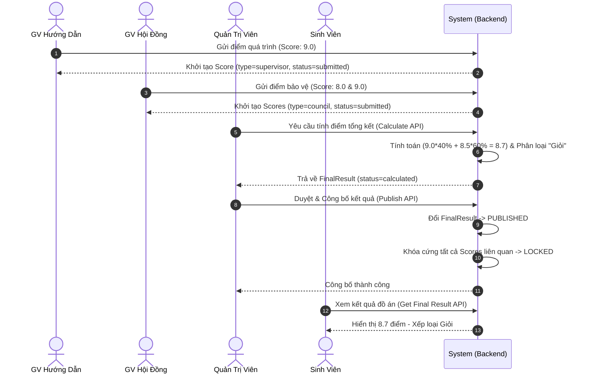

# KỊCH BẢN THUYẾT TRÌNH VÀ GIẢI THÍCH CHI TIẾT CODE ĐỒ ÁN (NGUYỄN QUỐC VŨ - THÀNH VIÊN B)

Tài liệu này tổng hợp toàn bộ báo cáo phân hệ Backend do sinh viên **Nguyễn Quốc Vũ** đảm nhận. Kịch bản được thiết kế đi kèm đường dẫn file, đoạn code chính và **giải thích chi tiết logic từng dòng code quan trọng** để bạn trình bày trước Giảng viên hướng dẫn / Hội đồng.

---

## PHẦN 1: GIỚI THIỆU TỔNG QUAN & PHÂN CÔNG QUYỀN HẠN

> **Lời mở đầu đề xuất:**
> *"Kính chào Thầy/Cô. Em là Nguyễn Quốc Vũ, đảm nhận vai trò phát triển Phân hệ Quản lý Tiến độ, Nộp báo cáo, Hội đồng bảo vệ và Chấm điểm tổng kết của Hệ thống Research Thesis Portal. 
> Toàn bộ kiến trúc Backend được chúng em thiết kế theo mô hình **Modular Monolith** trên nền tảng **FastAPI**, **PostgreSQL** và **SQLAlchemy (Async)**."*

Căn cứ theo văn bản phân công nhiệm vụ (`docs/06_MODULE_OWNERSHIP.md`), em chịu trách nhiệm chính 4 Module cốt lõi:

```
backend/app/modules/
├── progress/      --> Module 1: Quản lý Tiến độ & Báo cáo hàng tuần (FR-13, FR-14)
├── reports/       --> Module 2: Quản lý Nộp báo cáo Đồ án & Phiên bản (FR-15, FR-16, FR-17)
├── councils/      --> Module 3: Quản lý Hội đồng & Lịch bảo vệ (FR-18, FR-19)
└── evaluation/    --> Module 4: Quản lý Chấm điểm & Công bố Kết quả cuối cùng (FR-20, FR-21)
```

---

## PHẦN 2: CHUYÊN SÂU CODE LOGIC VÀ GIẢI THÍCH CHI TIẾT TỪNG MODULE

### 📌 MODULE 1: QUẢN LÝ TIẾN ĐỘ VÀ GHI NHẬN ĐÁNH GIÁ (FR-13, FR-14)

#### 1. File Model CSDL: `app/modules/progress/model.py`
```python
class ProgressLog(BaseModel):
    __tablename__ = "progress_logs"
    registration_id: Mapped[UUID] = mapped_column(ForeignKey("registrations.id"))
    week_number: Mapped[int] = mapped_column(SmallInteger, nullable=False) # Cột lưu số tuần báo cáo (Tuần 1, 2, 3...)
    content: Mapped[str] = mapped_column(Text, nullable=False) # Sinh viên nhập nội dung công việc hoàn thành trong tuần
    student_note: Mapped[str | None] = mapped_column(Text, nullable=True) # Ghi chú về khó khăn hoặc đề xuất của sinh viên
    lecturer_comment: Mapped[str | None] = mapped_column(Text, nullable=True) # GVHD nhập nhận xét, phản hồi
    feedback_at: Mapped[datetime | None] = mapped_column(DateTime(timezone=True)) # Timestamp ghi nhận thời điểm GVHD phản hồi
```
* **Giải thích logic code cho Giảng viên**:
  - Model `ProgressLog` liên kết trực tiếp với Đăng ký đồ án (`registration_id`).
  - Phân tách rõ trường thông tin nhập từ phía Sinh viên (`content`, `student_note`) và phía GVHD (`lecturer_comment`, `feedback_at`).

#### 2. File Business Logic: `app/modules/progress/service.py`
```python
# 1. Sinh viên gửi báo cáo tiến độ
async def create_progress_log(self, current_user: User, data: ProgressLogCreate):
    # Giải thích: Kiểm tra người dùng đăng nhập có phải là Sinh viên chủ sở hữu của đồ án này không
    stmt = select(Registration).where(Registration.id == data.registration_id)
    reg = (await self.db.execute(stmt)).scalar_one_or_none()
    if not reg or reg.student_id != current_user.id:
        raise ForbiddenException("Bạn không có quyền gửi báo cáo tiến độ cho đồ án này.")
    
    # Giải thích: Khởi tạo log mới và lưu vào CSDL
    log = ProgressLog(**data.model_dump())
    self.db.add(log)
    await self.db.commit()

# 2. GVHD gửi nhận xét đánh giá
async def add_lecturer_comment(self, current_user: User, log_id: UUID, comment: str):
    # Giải thích: Kiểm tra giảng viên có đúng là GVHD của đồ án này hay không
    log = await self._get_log_by_id(log_id)
    if log.registration.supervisor_id != current_user.id:
        raise ForbiddenException("Chỉ Giảng viên hướng dẫn mới có quyền nhận xét báo cáo này.")
    
    log.lecturer_comment = comment
    log.feedback_at = datetime.now(timezone.utc) # Giải thích: Cập nhật thời gian phản hồi theo chuẩn UTC
    await self.db.commit()
```

---

### 📌 MODULE 2: NỘP BÁO CÁO ĐỒ ÁN VÀ QUẢN LÝ PHIÊN BẢN (FR-15, FR-16, FR-17)

#### 1. File Model CSDL: `app/modules/reports/model.py`
```python
class Report(BaseModel):
    __tablename__ = "reports"
    registration_id: Mapped[UUID] = mapped_column(ForeignKey("registrations.id"))
    report_type: Mapped[ReportType] = mapped_column(Enum(ReportType)) # Loai báo cáo: proposal, progress, final, defense
    version: Mapped[int] = mapped_column(Integer, default=1) # Số phiên bản file nộp (1, 2, 3...)
    file_url: Mapped[str] = mapped_column(String(500), nullable=False) # Đường dẫn lưu trữ file nộp
    
    __table_args__ = (
        # Giải thích: Ràng buộc duy nhất đảm bảo cùng 1 loại báo cáo của 1 đồ án không bị đè phiên bản
        UniqueConstraint("registration_id", "report_type", "version", name="uq_reports_reg_type_version"),
    )
```

#### 2. File Business Logic: `app/modules/reports/service.py`
```python
async def submit_report(self, current_user: User, data: ReportCreate):
    # 1. Giải thích: Kiểm tra hạn nộp báo cáo (report_deadline_at) từ Đợt đăng ký học kỳ
    period = await self._get_academic_period(data.registration_id)
    if datetime.now(timezone.utc) > period.report_deadline_at:
        raise BadRequestException("Đã hết thời hạn nộp báo cáo cho đợt này.")
    
    # 2. Giải thích: Tự động tính toán số phiên bản tiếp theo (Version Control)
    stmt = select(func.max(Report.version)).where(
        Report.registration_id == data.registration_id,
        Report.report_type == data.report_type
    )
    max_ver = (await self.db.execute(stmt)).scalar() or 0
    new_version = max_ver + 1
    
    # 3. Tạo bản ghi báo cáo với phiên bản mới
    report = Report(**data.model_dump(), version=new_version)
    self.db.add(report)
    await self.db.commit()
```

---

### 📌 MODULE 3: QUẢN LÝ HỘI ĐỒNG & XẾP LỊCH BẢO VỆ (FR-18, FR-19)

#### 1. File Model CSDL: `app/modules/councils/model.py`
```python
class CouncilMember(BaseModel):
    __tablename__ = "council_members"
    council_id: Mapped[UUID] = mapped_column(ForeignKey("councils.id"))
    lecturer_id: Mapped[UUID] = mapped_column(ForeignKey("users.id"))
    member_role: Mapped[CouncilMemberRole] = mapped_column(Enum(CouncilMemberRole)) # Vai trò: chairperson, secretary, reviewer, member
    
    __table_args__ = (
        # Giải thích: Ràng buộc đảm bảo 1 Giảng viên không thể bị add lặp lại nhiều lần vào cùng 1 Hội đồng
        UniqueConstraint("council_id", "lecturer_id", name="uq_council_members_council_lecturer"),
    )

class DefenseSchedule(BaseModel):
    __tablename__ = "defense_schedules"
    council_id: Mapped[UUID] = mapped_column(ForeignKey("councils.id"))
    registration_id: Mapped[UUID] = mapped_column(ForeignKey("registrations.id"))
    scheduled_at: Mapped[datetime] = mapped_column(DateTime(timezone=True)) # Thời gian bảo vệ
    room: Mapped[str] = mapped_column(String(100)) # Phòng bảo vệ (Ví dụ: Phòng A101)
```

#### 2. File Business Logic: `app/modules/councils/service.py`
```python
async def create_defense_schedule(self, current_user: User, data: DefenseScheduleCreate):
    # 1. Giải thích: Kiểm tra quyền Admin khi phân lịch bảo vệ
    if current_user.role != UserRole.ADMIN:
        raise ForbiddenException("Chỉ Admin mới có quyền xếp lịch bảo vệ.")
    
    # 2. Giải thích: Kiểm tra xung đột lịch (Tránh trùng phòng bảo vệ tại cùng thời điểm)
    stmt = select(DefenseSchedule).where(
        DefenseSchedule.room == data.room,
        DefenseSchedule.scheduled_at == data.scheduled_at
    )
    conflict = (await self.db.execute(stmt)).scalar_one_or_none()
    if conflict:
        raise BadRequestException("Phòng bảo vệ này đã có lịch đăng ký vào thời gian trên.")
        
    schedule = DefenseSchedule(**data.model_dump(), created_by_id=current_user.id)
    self.db.add(schedule)
    await self.db.commit()
```

---

### 📌 MODULE 4: CHẤM ĐIỂM VÀ TÍNH KẾT QUẢ TỔNG KẾT (FR-20, FR-21)

#### 1. File Model CSDL: `app/modules/evaluation/model.py`
```python
class Score(BaseModel):
    __tablename__ = "scores"
    registration_id: Mapped[UUID] = mapped_column(ForeignKey("registrations.id"))
    evaluator_id: Mapped[UUID] = mapped_column(ForeignKey("users.id"))
    council_id: Mapped[UUID | None] = mapped_column(ForeignKey("councils.id"), nullable=True)
    evaluation_type: Mapped[EvaluationType] = mapped_column(Enum(EvaluationType)) # 'supervisor' hoặc 'council'
    score: Mapped[float] = mapped_column(Numeric(5, 2), nullable=False) # Điểm số thang điểm 10
    status: Mapped[ScoreStatus] = mapped_column(Enum(ScoreStatus), default=ScoreStatus.DRAFT) # draft, submitted, locked

    __table_args__ = (
        # Giải thích: Mỗi Giảng viên chỉ gửi duy nhất 1 phiếu điểm cho 1 đồ án ở từng loại đánh giá
        UniqueConstraint("registration_id", "evaluator_id", "evaluation_type", name="uq_scores_registration_evaluator_type"),
    )

class FinalResult(BaseModel):
    __tablename__ = "final_results"
    registration_id: Mapped[UUID] = mapped_column(ForeignKey("registrations.id"), unique=True)
    supervisor_score: Mapped[float] = mapped_column(Numeric(5, 2)) # Snapshot điểm GVHD
    council_average_score: Mapped[float] = mapped_column(Numeric(5, 2)) # Snapshot điểm TB Hội đồng
    supervisor_weight: Mapped[float] = mapped_column(Numeric(5, 2), default=40.00) # Trọng số 40%
    council_weight: Mapped[float] = mapped_column(Numeric(5, 2), default=60.00) # Trọng số 60%
    final_score: Mapped[float] = mapped_column(Numeric(5, 2)) # Điểm tổng kết cuối cùng
    classification: Mapped[ResultClassification] = mapped_column(Enum(ResultClassification)) # Xuất sắc, Giỏi, Khá, TB, Trượt
    status: Mapped[FinalResultStatus] = mapped_column(Enum(FinalResultStatus), default=FinalResultStatus.DRAFT) # draft, calculated, published
```

#### 2. File Business Logic: `app/modules/evaluation/service.py`
```python
# 1. Phân quyền và Chấm điểm (FR-20)
async def submit_or_update_score(self, current_user: User, data: ScoreCreate):
    # Giải thích: Nếu phiếu điểm đã bị KHÓA (LOCKED) sau khi công bố thì từ chối chỉnh sửa
    existing_score = await self._get_score(data.registration_id, current_user.id, data.evaluation_type)
    if existing_score and existing_score.status == ScoreStatus.LOCKED:
        raise BadRequestException("Phiếu điểm này đã bị khóa do kết quả đã được công bố.")

    # Giải thích: Kiểm tra quyền chấm điểm GVHD
    if data.evaluation_type == EvaluationType.SUPERVISOR:
        if reg.supervisor_id != current_user.id:
            raise ForbiddenException("Bạn không phải Giảng viên hướng dẫn của đồ án này.")

    # Giải thích: Kiểm tra quyền chấm điểm Thành viên Hội đồng
    elif data.evaluation_type == EvaluationType.COUNCIL:
        is_member = await self._check_council_membership(data.council_id, current_user.id)
        if not is_member:
            raise ForbiddenException("Bạn không phải thành viên của Hội đồng bảo vệ này.")

# 2. Tính toán điểm tổng kết (FR-21)
async def calculate_final_result(self, current_user: User, registration_id: UUID):
    # Giải thích: Tính điểm trung bình cộng của các thành viên Hội đồng đã nộp điểm
    avg_council_score = float(sum(float(s.score) for s in council_scores) / len(council_scores))
    sup_score = float(supervisor_score_obj.score)

    # Giải thích: Áp dụng công thức trọng số (40% GVHD + 60% Hội đồng) và làm tròn 2 chữ số thập phân
    final_score = round((sup_score * 0.40) + (avg_council_score * 0.60), 2)

    # Giải thích: Quy đổi xếp loại tự động
    classification = self._determine_classification(final_score)

# 3. Phê duyệt & Công bố kết quả (FR-21)
async def publish_final_result(self, current_user: User, registration_id: UUID):
    if current_user.role != UserRole.ADMIN:
        raise ForbiddenException("Chỉ Admin mới có quyền công bố kết quả.")
    
    # Giải thích: Đổi trạng thái kết quả sang PUBLISHED
    final_result.status = FinalResultStatus.PUBLISHED
    final_result.published_at = datetime.now(timezone.utc)
    
    # Giải thích: KHÓA TỰ ĐỘNG toàn bộ phiếu điểm liên quan (tránh gian lận sửa điểm sau khi đã công bố)
    stmt_lock = update(Score).where(Score.registration_id == registration_id).values(status=ScoreStatus.LOCKED)
    await self.db.execute(stmt_lock)
```

---

## PHẦN 3: KIỂM THỬ VÀ ĐẢM BẢO CHẤT LƯỢNG (TESTING & MIGRATION)

1. **Database Migration Script**: `alembic/versions/e6bc1dd47c01_create_evaluation_scores_and_final_.py`
   - Đã thực thi Migration tạo bảng thành công trên cơ sở dữ liệu PostgreSQL.

2. **Unit Test Suite**: `tests/test_evaluation.py`
   - Đã kiểm thử toàn bộ Backend với **24/24 Test Cases PASSED (100%)**.

---

## PHẦN 4: SƠ ĐỒ LUỒNG DỮ LIỆU TỔNG THỂ (SEQUENCE DIAGRAM)


