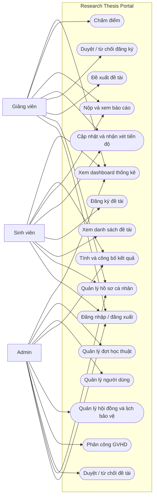
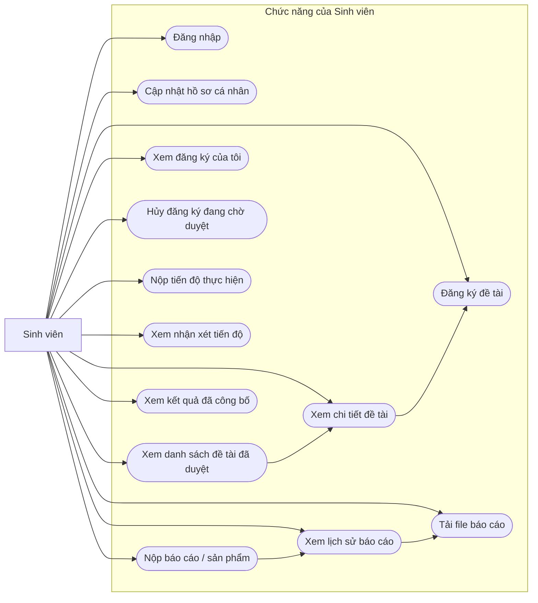
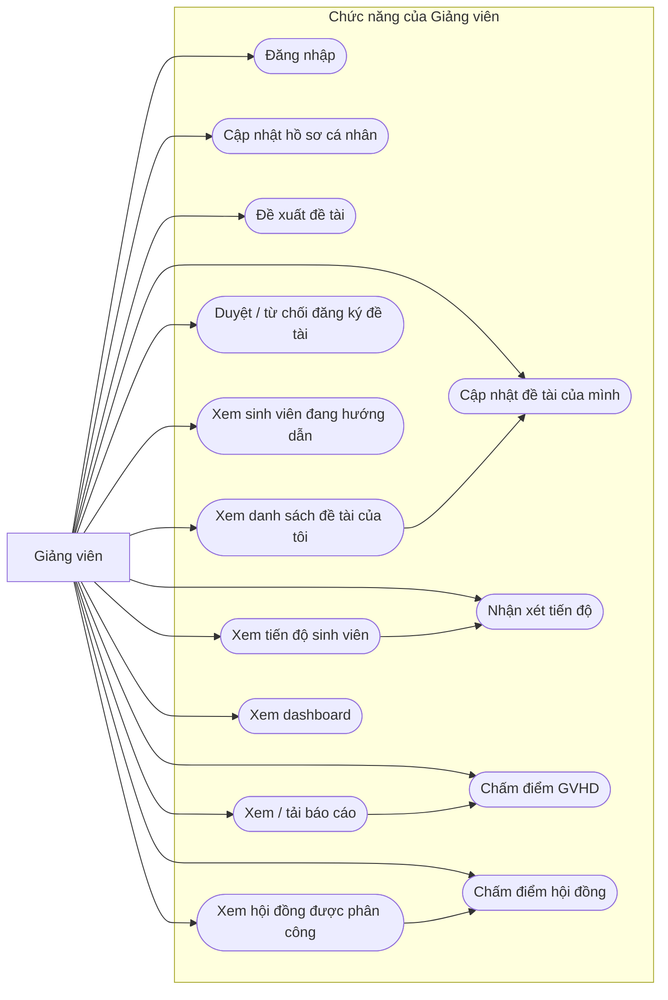
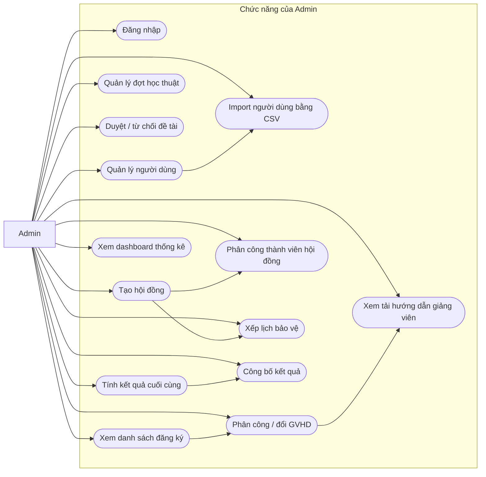
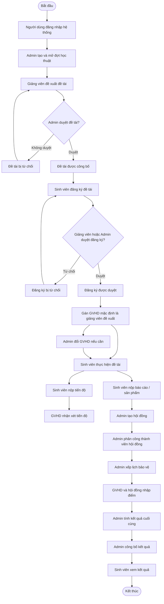
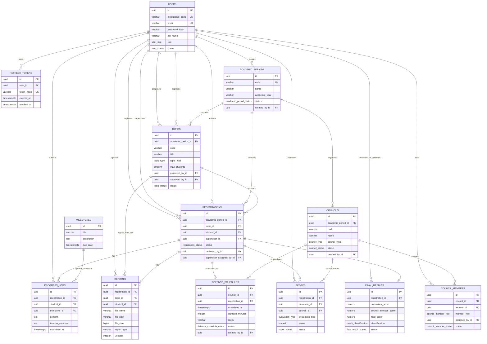
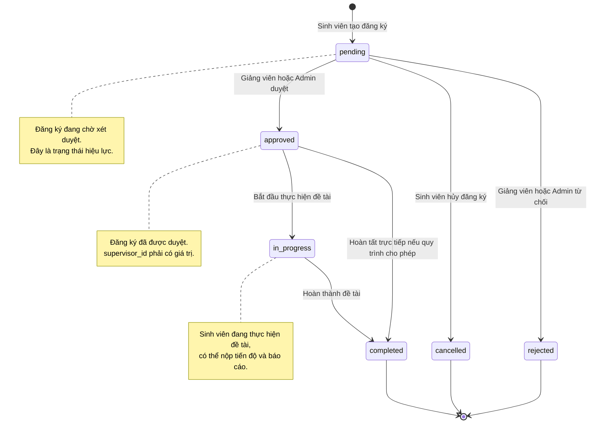
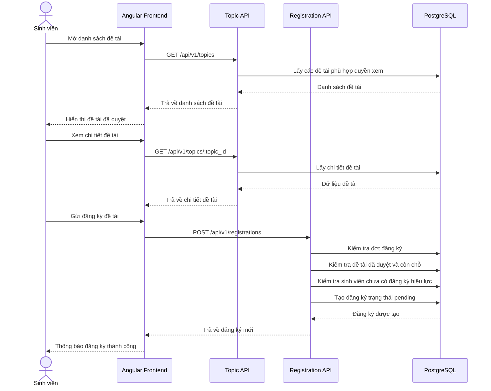
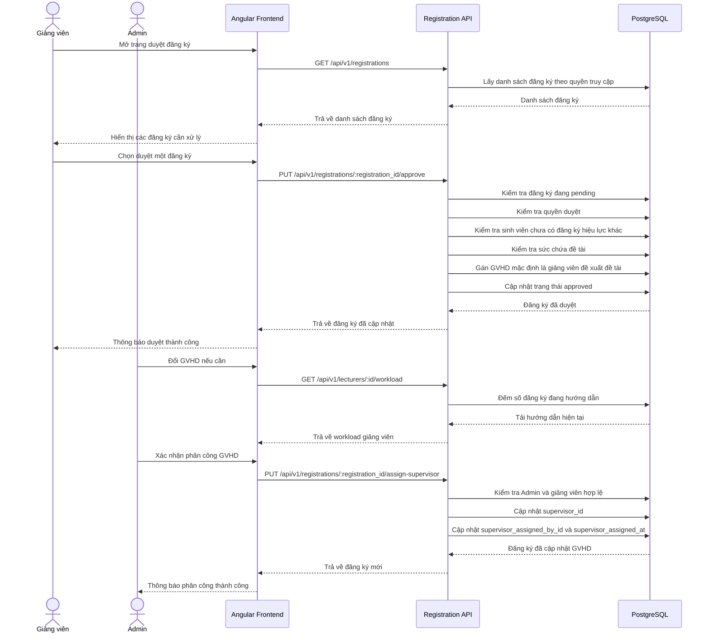
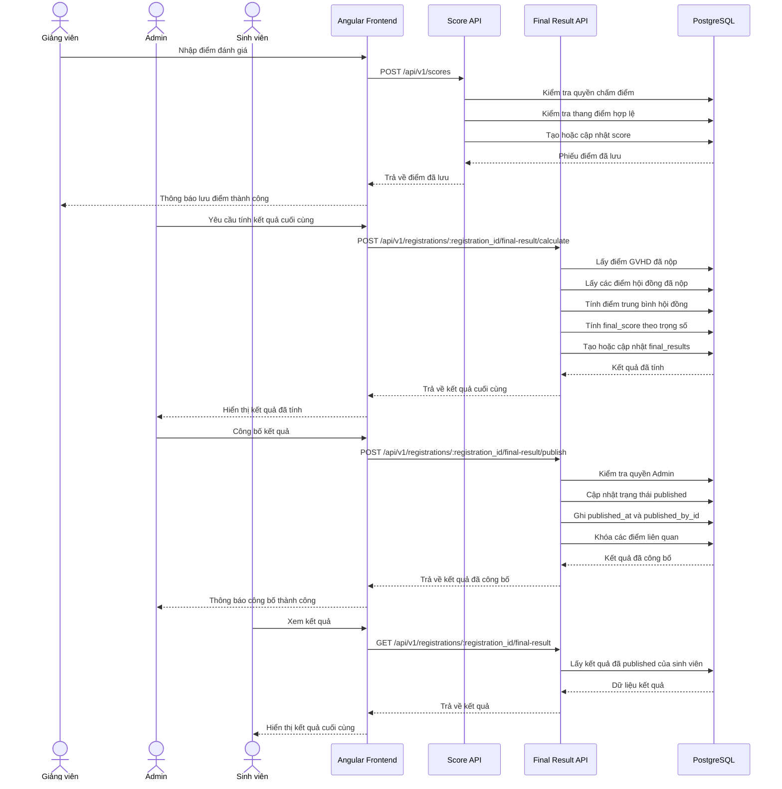

# Sơ đồ hệ thống Research Thesis Portal

File này tổng hợp các sơ đồ Mermaid dùng cho báo cáo và GitHub Markdown. Các sơ đồ bám theo hệ thống hiện tại của dự án Research Thesis Portal.

> GitHub hỗ trợ render Mermaid trực tiếp trong file `.md`.

---

## 3.1 — Sơ đồ Use Case tổng quát của hệ thống

---

## 3.1.2 — Use Case chi tiết Sinh viên

---

## 3.1.3 — Use Case chi tiết Giảng viên

---

## 3.1.4 — Use Case chi tiết Admin

---

## 3.5 — Quy trình nghiệp vụ tổng thể từ đăng ký đến đánh giá, nghiệm thu

---

## 4.2 — Sơ đồ quan hệ dữ liệu ERD đúng với 13 bảng hiện tại

---

## 4.5 — State Machine của đăng ký đề tài

---

## 4.6 — Sequence Diagram đăng ký đề tài

---

## 4.6 — Sequence Diagram duyệt đăng ký đề tài

---

## 4.6 — Sequence Diagram tính và công bố kết quả

