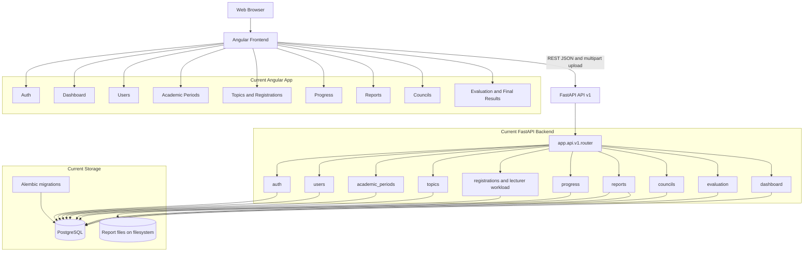
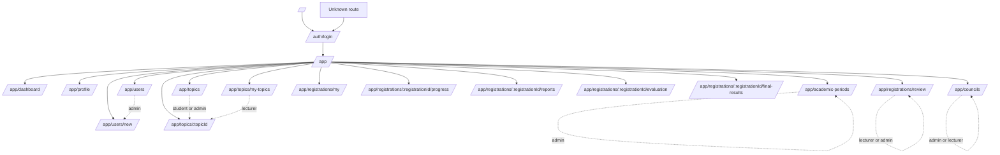
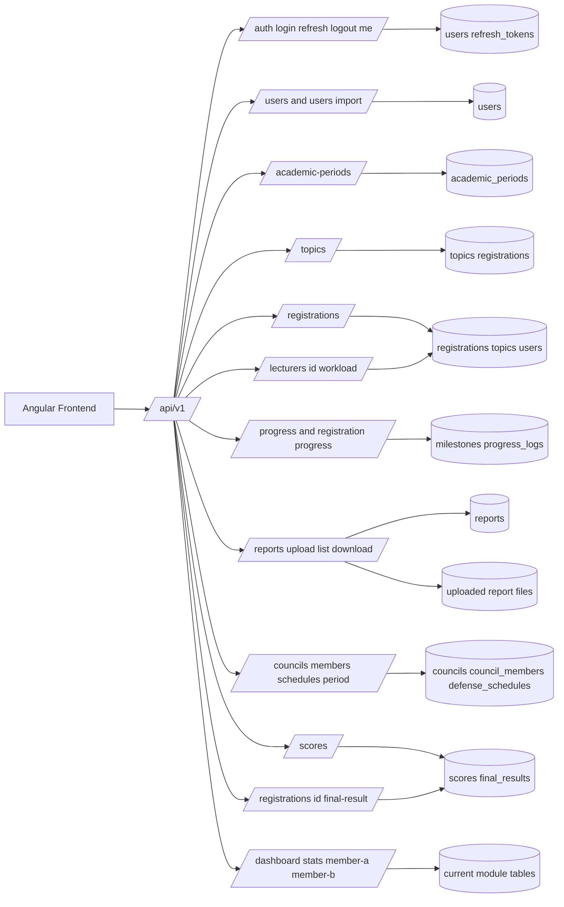
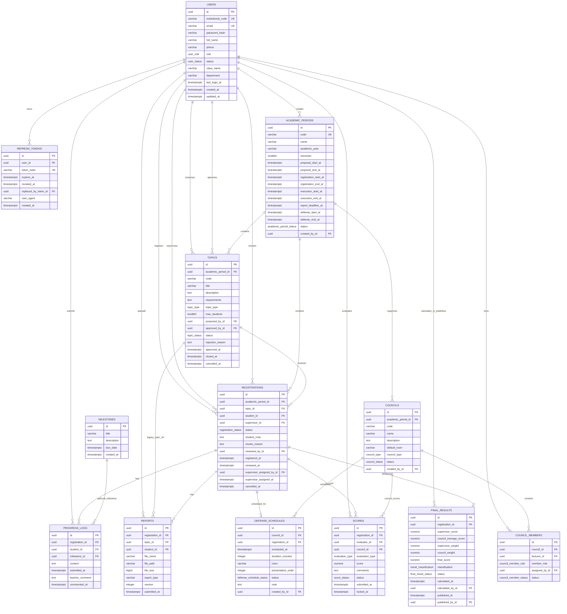
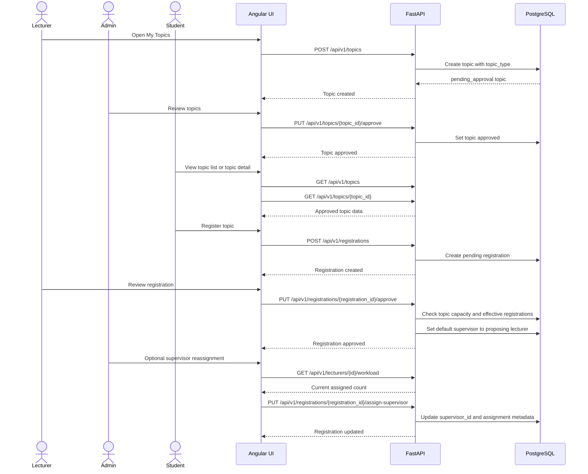
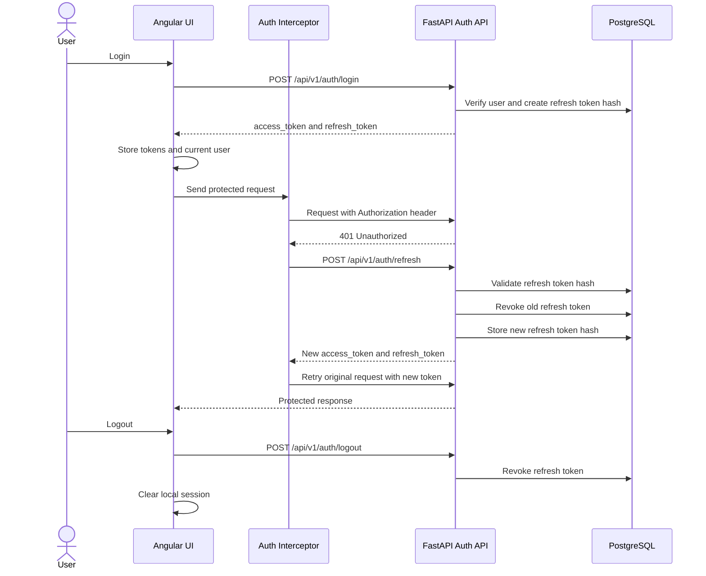
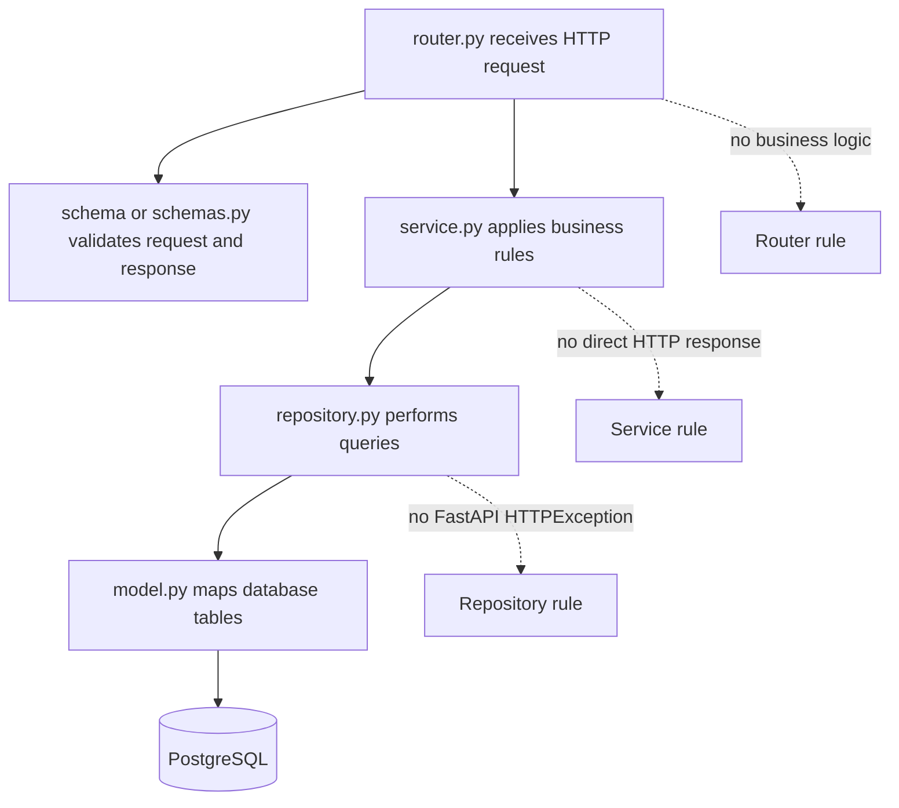
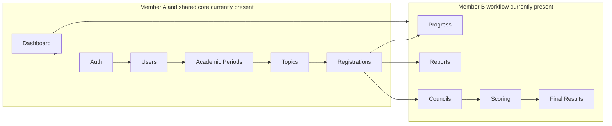

# Research Thesis Portal Diagrams

This file documents the current implemented project structure using Mermaid diagrams. GitHub renders Mermaid diagrams automatically in Markdown files.

> Scope: these diagrams follow the current repository implementation, not only the full future design in the planning documents.

---

## 1. Current System Architecture



---

## 2. Current Frontend Routes



---

## 3. Current API Module Map



---

## 4. Current Implemented ERD



---

## 5. Current Topic and Registration Flow



---

## 6. Current Student Execution Flow

```mermaid
flowchart TD
    ApprovedReg[Approved registration] --> ProgressPage[Open registration progress page]
    ProgressPage --> SubmitProgress[Student submits progress]
    SubmitProgress --> ProgressAPI[POST /api/v1/progress]
    ProgressAPI --> ProgressLog[(progress_logs)]

    ProgressLog --> LecturerComment[Lecturer adds teacher_comment]
    LecturerComment --> CommentAPI[POST /api/v1/progress/{id}/comments]
    CommentAPI --> ProgressLog

    ApprovedReg --> ReportPage[Open registration reports page]
    ReportPage --> UploadReport[Student uploads report file]
    UploadReport --> ReportAPI[POST /api/v1/reports]
    ReportAPI --> ReportRow[(reports row with version number)]
    ReportAPI --> ReportFile[(uploaded file)]

    ReportPage --> ReportHistory[View report history]
    ReportHistory --> ReportListAPI[GET /api/v1/registrations/{registrationId}/reports]
    ReportListAPI --> ReportRow

    ReportHistory --> Download[Download report]
    Download --> DownloadAPI[GET /api/v1/reports/{reportId}/download]
    DownloadAPI --> ReportFile
```

---

## 7. Current Council, Scoring, and Final Result Flow

```mermaid
flowchart TD
    Admin[Admin] --> CreateCouncil[Create council]
    CreateCouncil --> CouncilAPI[POST /api/v1/councils]
    CouncilAPI --> Councils[(councils)]

    Admin --> AddMembers[Assign lecturers to council]
    AddMembers --> MemberAPI[POST /api/v1/councils/{councilId}/members]
    MemberAPI --> CouncilMembers[(council_members)]

    Admin --> ScheduleDefense[Create defense schedule]
    ScheduleDefense --> ScheduleAPI[POST /api/v1/councils/{councilId}/schedules]
    ScheduleAPI --> DefenseSchedules[(defense_schedules)]

    Lecturer[Lecturer or council member] --> SubmitScore[Submit or update score]
    SubmitScore --> ScoreAPI[POST /api/v1/scores]
    ScoreAPI --> Scores[(scores)]

    Lecturer --> EditScore[Update score before lock]
    EditScore --> UpdateScoreAPI[PUT /api/v1/scores/{scoreId}]
    UpdateScoreAPI --> Scores

    Admin --> CalculateResult[Calculate final result]
    CalculateResult --> CalculateAPI[POST /api/v1/registrations/{registrationId}/final-result/calculate]
    CalculateAPI --> FinalResults[(final_results)]

    Admin --> PublishResult[Publish final result]
    PublishResult --> PublishAPI[POST /api/v1/registrations/{registrationId}/final-result/publish]
    PublishAPI --> FinalResults
    PublishAPI --> ScoresLocked[Related scores locked]

    Student[Student] --> ViewResult[View published final result]
    ViewResult --> GetResultAPI[GET /api/v1/registrations/{registrationId}/final-result]
    GetResultAPI --> FinalResults
```

---

## 8. Current Authentication and Refresh Flow



---

## 9. Current Backend Layering Pattern



---

## 10. Current Module Completion Snapshot


