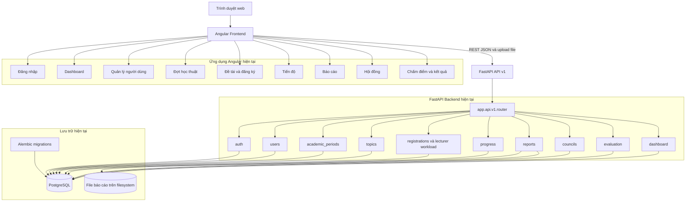
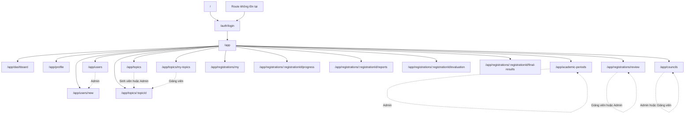
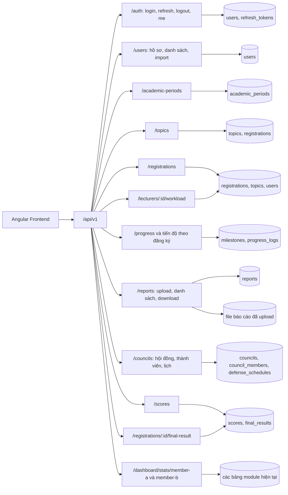
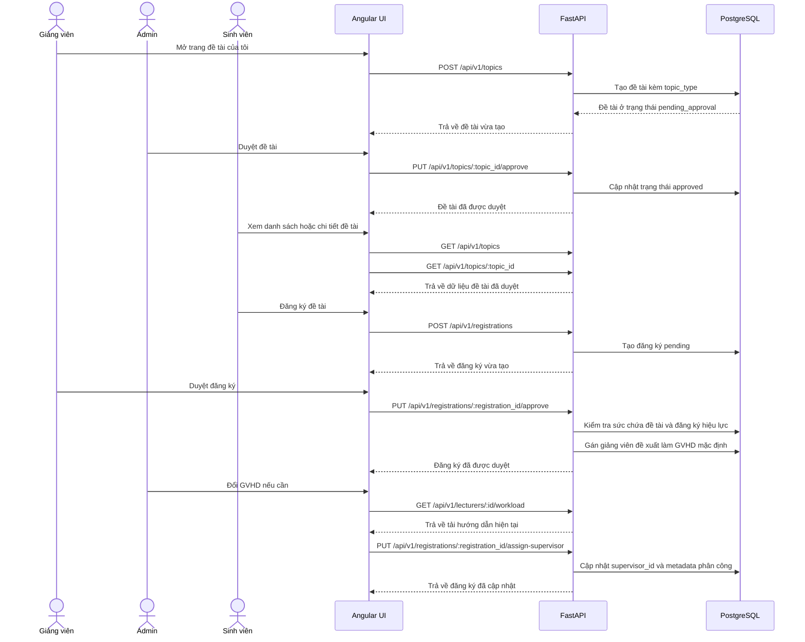
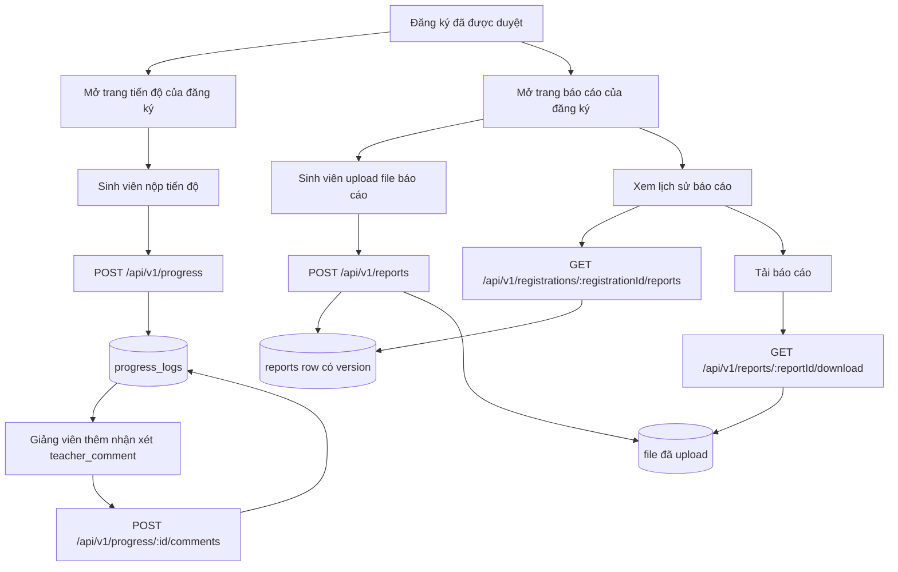
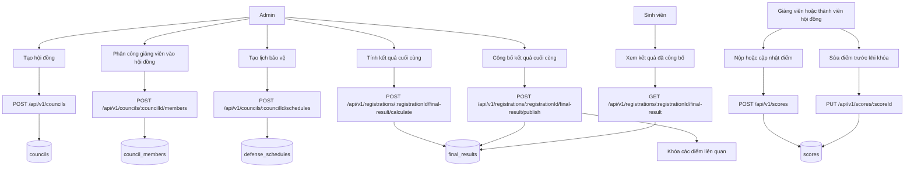
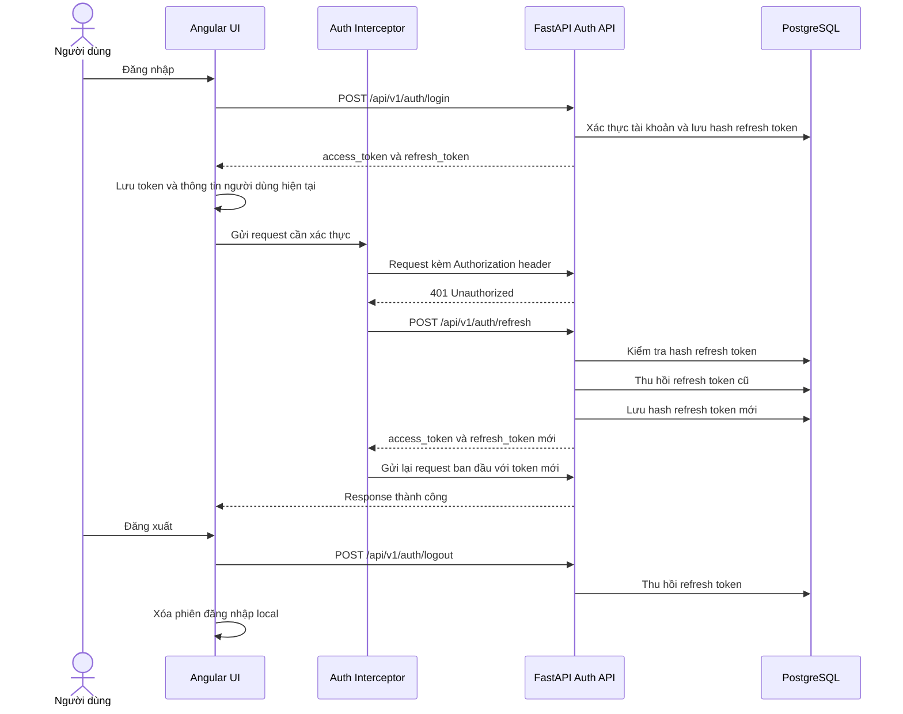
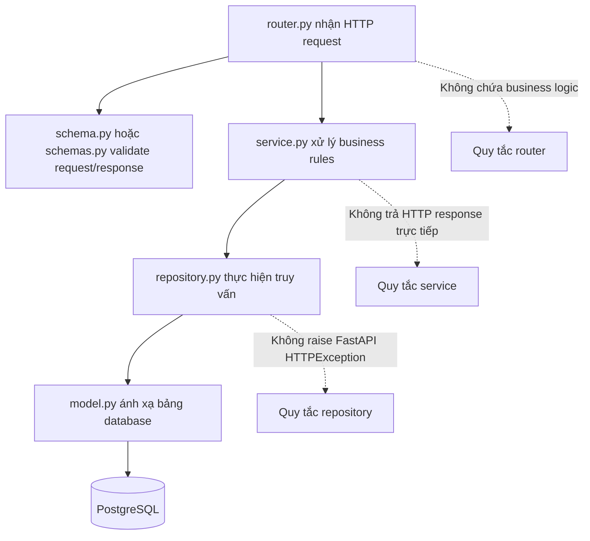
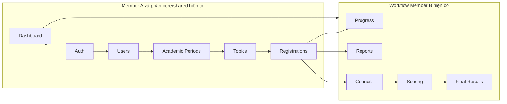

# Sơ đồ hệ thống Research Thesis Portal

File này mô tả cấu trúc dự án hiện tại bằng Mermaid diagrams. Khi push lên GitHub, các khối Mermaid sẽ được GitHub render thành sơ đồ.

> Phạm vi: các sơ đồ bám sát code hiện tại trong repository, không vẽ theo toàn bộ thiết kế tương lai nếu chưa có module/UI rõ ràng trong dự án.

---

## 1. Kiến trúc hệ thống hiện tại

---

## 2. Các route frontend hiện tại

---

## 3. Bản đồ module API hiện tại

---

## 4. ERD triển khai hiện tại

---

## 5. Luồng đề tài, đăng ký và phân công giảng viên hướng dẫn

---

## 6. Luồng thực hiện của sinh viên

---

## 7. Luồng hội đồng, chấm điểm và kết quả cuối cùng

---

## 8. Luồng đăng nhập và refresh token hiện tại

---

## 9. Mô hình phân lớp backend hiện tại

---

## 10. Snapshot module hiện có

