# Sơ đồ hệ thống Research Thesis Portal

File này tổng hợp các sơ đồ Mermaid dùng cho báo cáo và GitHub Markdown. Các sơ đồ bám theo hệ thống hiện tại của dự án Research Thesis Portal.

> Ghi chú trình bày: các sơ đồ lớn đã được rút gọn hoặc tách theo nhóm để khi đưa vào báo cáo/GitHub không bị quá nhỏ.

---

## 3.1 — Sơ đồ Use Case tổng quát của hệ thống

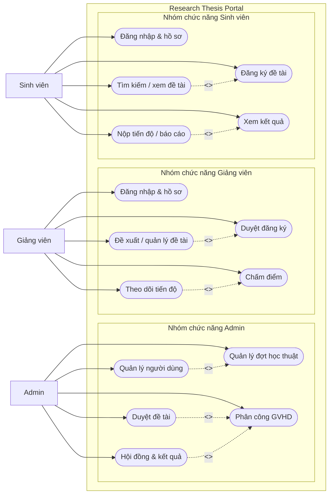

---

## 3.1.2 — Use Case chi tiết Sinh viên

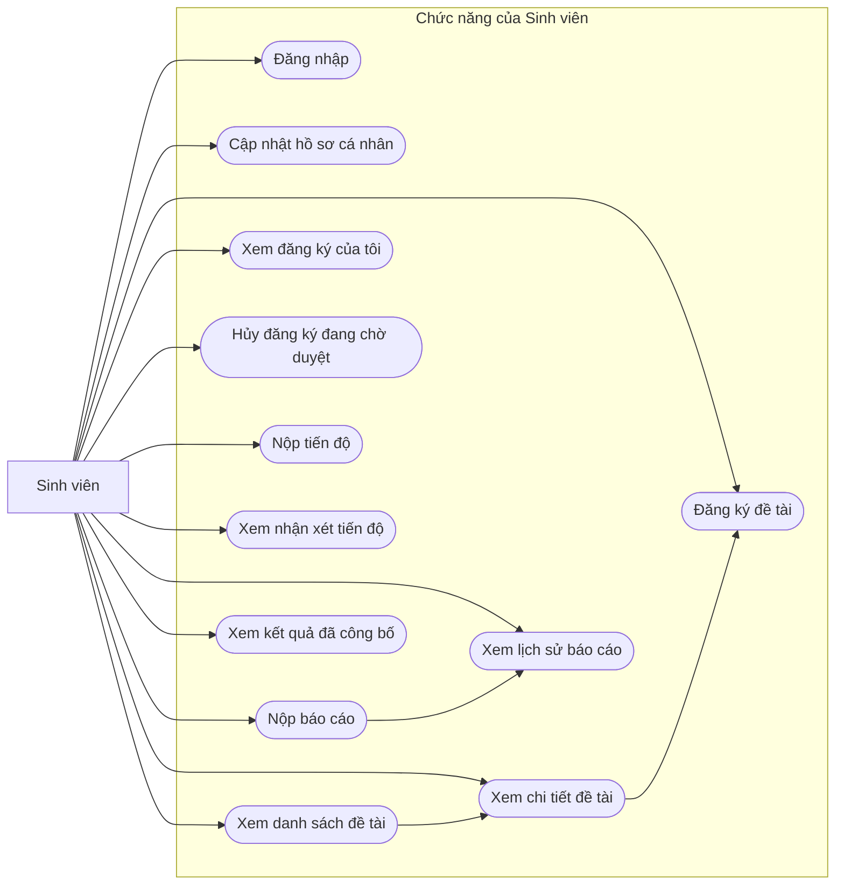

---

## 3.1.3 — Use Case chi tiết Giảng viên

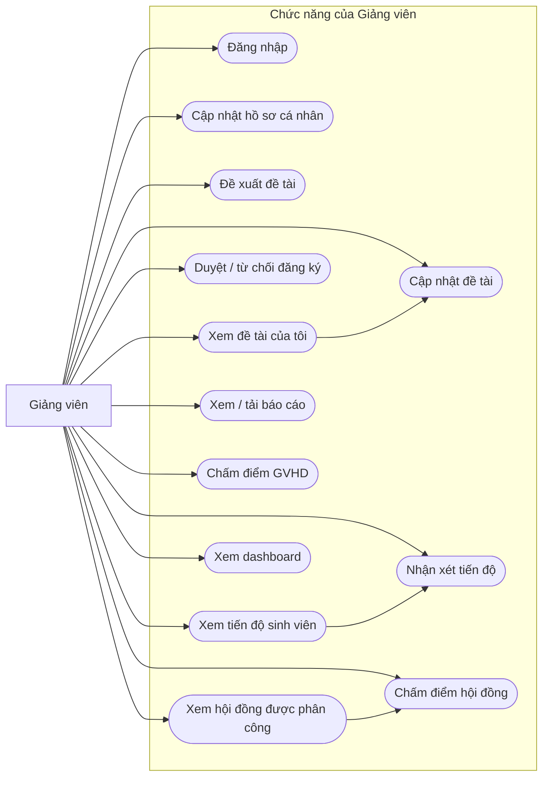

---

## 3.1.4 — Use Case chi tiết Admin

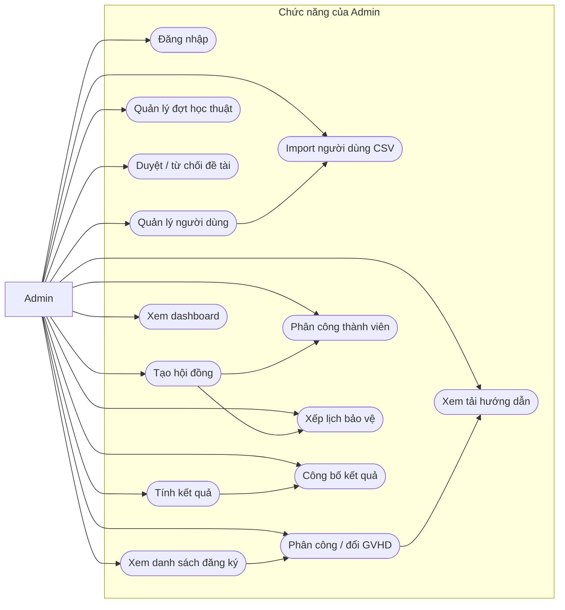

---

## 3.5 — Quy trình nghiệp vụ tổng thể từ đăng ký đến đánh giá, nghiệm thu

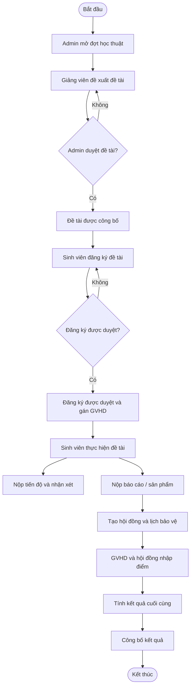

---

## 4.2 — ERD tổng quan 13 bảng hiện tại

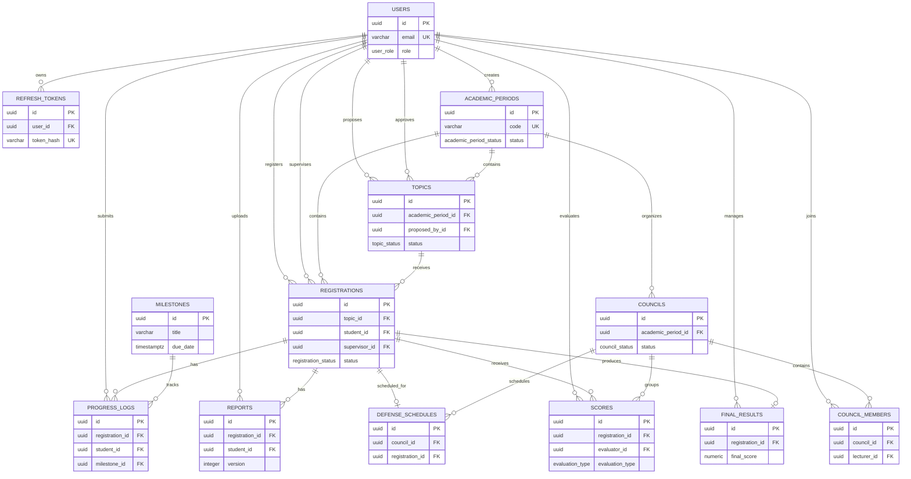

---

## 4.2.1 — ERD nhóm người dùng, đợt học thuật, đề tài và đăng ký

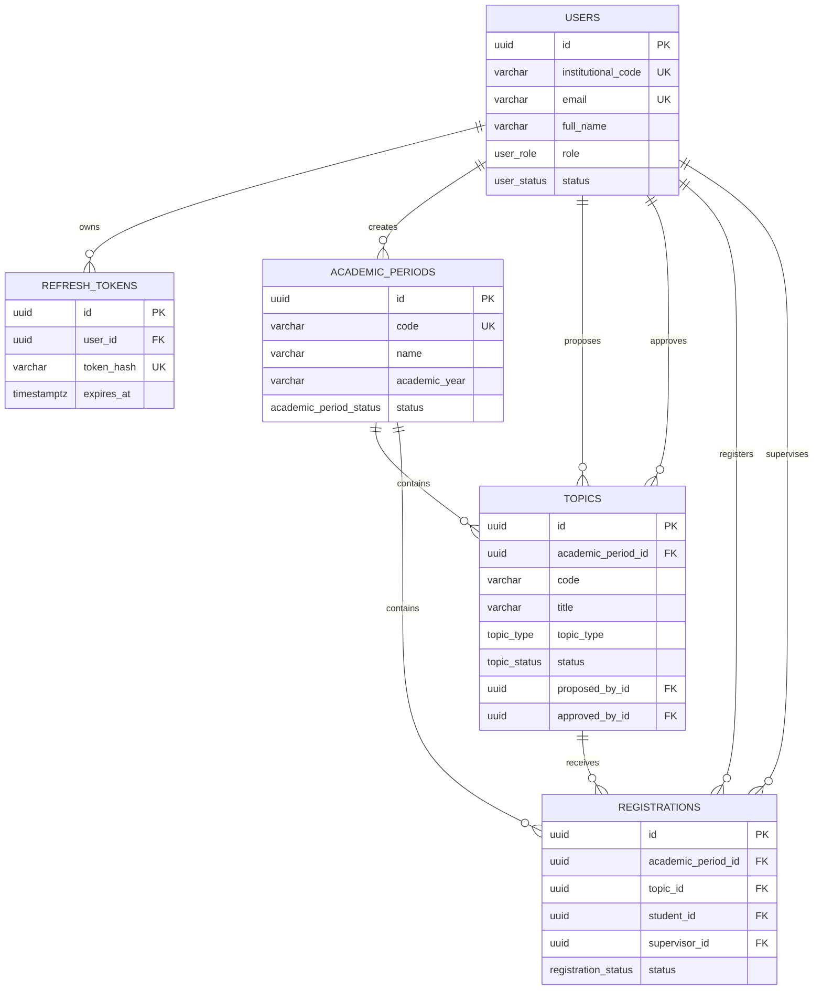

---

## 4.2.2 — ERD nhóm tiến độ và báo cáo

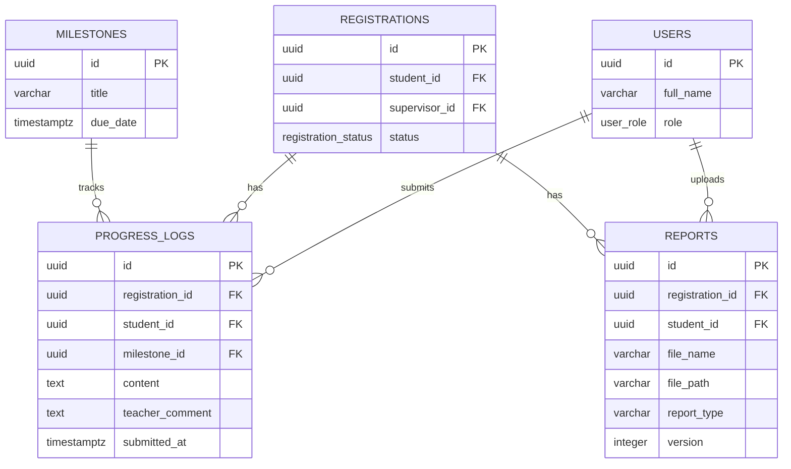

---

## 4.2.3 — ERD nhóm hội đồng, chấm điểm và kết quả

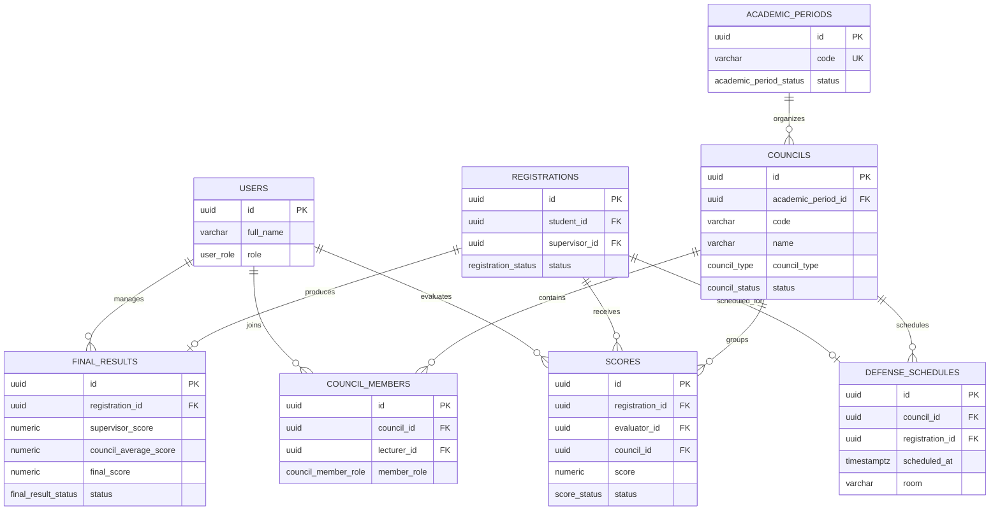

---

## 4.5 — State Machine của đăng ký đề tài

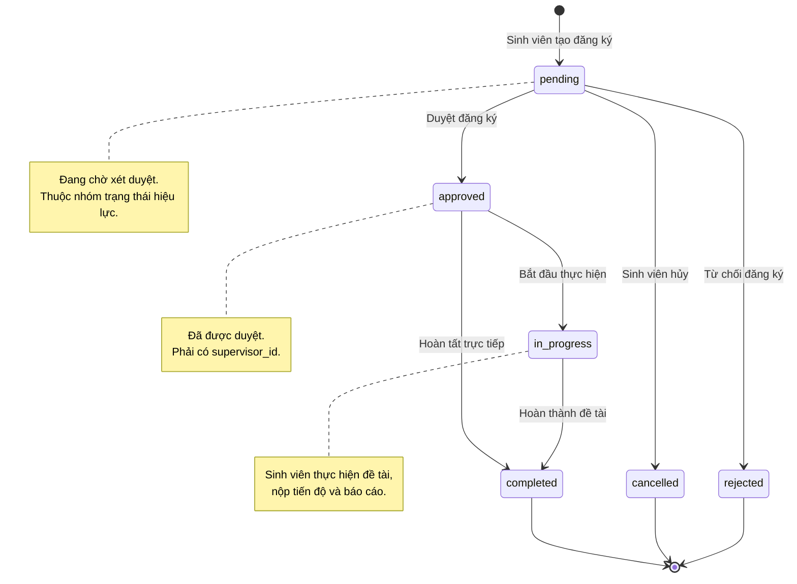

---

## 4.6 — Sequence Diagram đăng ký đề tài

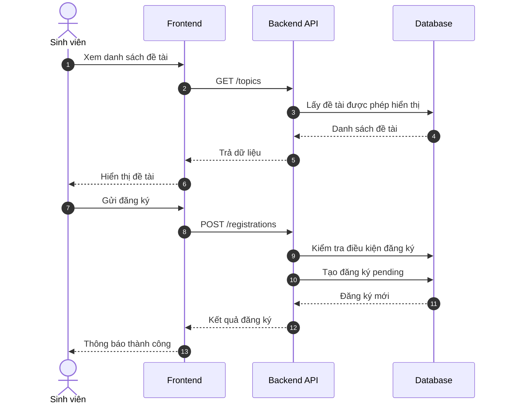

---

## 4.6 — Sequence Diagram duyệt đăng ký đề tài

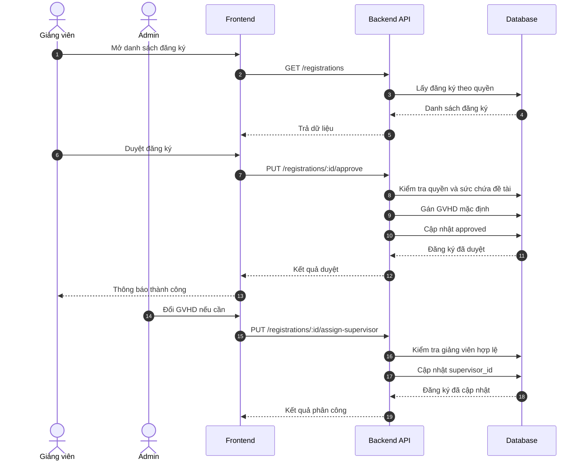

---

## 4.6 — Sequence Diagram tính và công bố kết quả

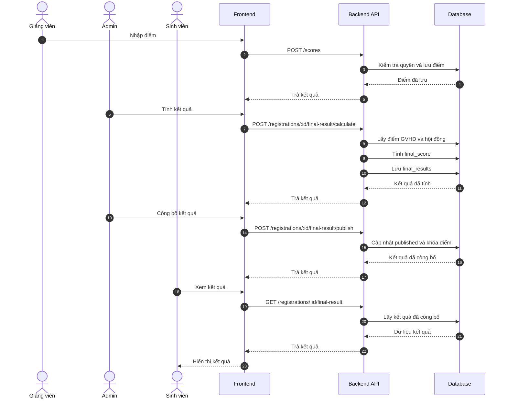
